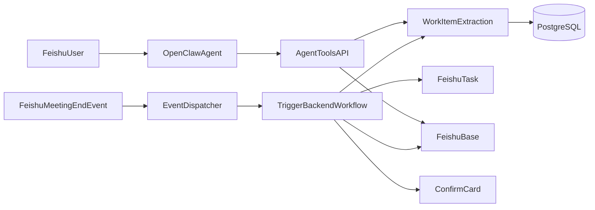
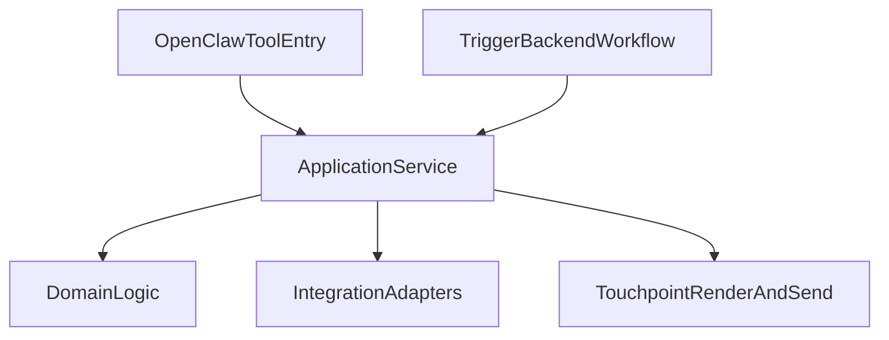

# FeishuAgent MVP 审阅整改计划

## 1. 审阅范围与当前结论

本次审阅面向当前 FeishuAgent MVP 的代码实现、赛题要求与项目文档，重点回答四个问题：

1. 当前实现是否满足 DRY、开闭原则、正交性、切面治理等工程原则。
2. 当前方案是否可以完成 `FeishuProject.md` 中的最终项目要求。
3. 文档与实现之间是否存在不一致，并判断应更新文档还是修正实现。
4. 哪些过程文档、临时文档或验证记录已经过时，可以删除、脱敏或归档。

总体判断：

- 当前项目已经形成 D 方向“团队待办中枢与进展自动对账”的早期 MVP 雏形。
- B 方向“会议与项目全链路伴侣”已经具备会后事项抽取入口，但还没有完成完整的人机确认闭环。
- 当前 MVP 只是最终系统的一小部分，不能把 MVP 范围误认为最终项目范围。
- 项目应继续按 `FeishuProject.md` 的最终要求设计全量系统：OpenClaw 主体、lark-cli / 飞书生态执行、多源知识接入、主动推送、真实评测。
- 在继续写代码前，应先收敛文档口径，明确当前阶段、后续阶段、待补齐能力和不再保留的过程材料。

当前已具备的核心链路偏后端闭环，OpenClaw 主体化能力仍需继续强化：



当前最主要的风险是：实现已经偏向“可演示 MVP”，但文档仍描述了更完整的生产化目标，包括会前卡片、卡片回调、多源接入、观测平台、评测体系等。若不先统一文档，会导致后续实现目标发散。

## 2. 工程原则审阅

## 2.1 DRY 与主体边界：OpenClaw 应是工作流主体，Trigger.dev 应是后端确定性工作流

项目要求是 OpenClaw + CLI + 飞书生态实现主动知识服务，因此系统主体不应表达为“Trigger.dev 驱动的后端工作流”。更准确的职责边界是：

| 层次 | 主体 | 职责 |
| --- | --- | --- |
| Agent 主体 | OpenClaw | 理解用户意图、选择办公场景、决定调用哪个工具、组织结果反馈 |
| 业务内核 | Node.js / TypeScript | WorkItem 状态机、数据库、幂等、审计、评测、确定性业务动作 |
| 后台工作流 | Trigger.dev | 定时任务、补偿任务、可靠重试、后台对账、长流程调度 |
| 飞书执行 | lark-cli / OpenAPI | 读取会议/文档/任务/消息，写任务、Base、卡片和文档 |

因此，Trigger.dev 不应承担“产品主体”角色；它主要负责后端工作流安排和可靠执行。OpenClaw 应负责面向用户和场景的主动 Agent 行为。

当前仍存在 DRY 问题，主要重复来自两个入口：

- Trigger.dev 工作流入口：`src/workflow/post-meeting.ts`
- OpenClaw HTTP 工具入口：`src/agent-tools/routes.ts`

两处都实现了类似流程：

1. 获取会议详情和妙记。
2. 调用 LLM 抽取 WorkItem。
3. 入库并归并。
4. 创建飞书任务。
5. 投影到 Base 总表。
6. 发送确认卡片。

问题：

- 同一个业务流程在两个入口中重复维护。
- 细节已经出现漂移，例如 `task_bindings` 插入时是否 `ON CONFLICT DO NOTHING` 不完全一致。
- 后续补充错误处理、审计、指标、卡片回调时，需要同时改多个位置。

建议修改：

- 新增应用服务层，例如 `src/application/work-item-service.ts`。不建议把共享业务服务放在 `workflow` 目录下，否则仍会强化 Trigger.dev 是主体的误解。
- 抽出以下共享函数：
  - `extractMeetingItemsFlow`
  - `syncWorkItemHubFlow`
  - `inspectRisksFlow`
- `src/workflow/post-meeting.ts` 只负责 Trigger.dev task 的 payload 适配。
- `src/agent-tools/routes.ts` 只负责 HTTP path、鉴权后的入参校验和响应格式。
- OpenClaw 通过 tool / skill 触发应用服务；Trigger.dev 通过后台 task 复用同一应用服务。

目标结构：



优先级：高。该问题会持续放大后续维护成本。

### HTTP 是否还需要保留

需要区分两类 HTTP：

1. OpenClaw Gateway HTTP `/v1/*`：当前不应作为 LLM 主路径保留。`src/domain/openclaw-client.ts` 已明确使用 WebSocket Gateway + device auth，并声明不再使用 HTTP `/v1/*` 和 DeepSeek fallback。相关旧文档应更新或归档。
2. `agent-tools` HTTP 服务：当前仍需要保留。它是 OpenClaw Skill 调用 FeishuAgent 业务能力的本地工具接口，例如 `extractMeetingItems`、`syncWorkItemHub`、`inspectRisks`。除非后续迁移到 OpenClaw Gateway 原生 tool RPC，否则此 HTTP 工具服务仍是必要桥接层。

建议：

- 删除或停止维护 OpenClaw `/v1/*` fallback 相关文档说明。
- 保留 `agent-tools` HTTP 服务，但强化鉴权、错误处理、审计和工具注册表。
- 在文档中统一表达为：“OpenClaw 主体通过 WebSocket Gateway 运行；项目业务工具通过本地 agent-tools HTTP API 暴露给 OpenClaw Skill。”

## 2.2 开闭原则：路由与事件分发仍是硬编码

当前主要问题：

- `src/agent-tools/routes.ts` 使用 `switch (pathname)` 分发工具。
- `src/trigger/dispatcher.ts` 使用 `switch (event.eventType)` 分发飞书事件。
- 新增一个事件类型或工具，都需要修改中心函数。

这对于 MVP 可以接受，但一旦补充日历事件、卡片回调、文档变更、任务变更、CLI 触发，就会快速膨胀。

建议修改：

- 将工具路由改为注册表：

```typescript
const toolHandlers = {
  "/tools/extractMeetingItems": extractMeetingItems,
  "/tools/syncWorkItemHub": syncWorkItemHub,
  "/tools/inspectRisks": inspectRisks,
  "/tools/queryWorkItems": queryWorkItems,
  "/tools/summarizeWorkItemHub": summarizeWorkItemHub,
}
```

- 将事件分发改为事件处理器注册表：

```typescript
const eventHandlers = {
  "vc.meeting.meeting_ended_v1": handleMeetingEnd,
  "meeting_end": handleMeetingEnd,
  "card_callback": handleCardCallback,
}
```

- 后续每新增一个触发源，只新增 handler 和 schema，不直接改核心 dispatcher 逻辑。

优先级：中高。卡片回调和更多事件源接入前应先改。

## 2.3 正交性：领域层、触点层和集成层边界不够清晰

当前主要问题：

1. `src/domain/work-item.ts` 中导入了 `projectWorkItemsToBase`，领域层直接触发飞书 Base 投影。
2. `src/touchpoint/card.ts` 同时负责渲染、发送卡片和写 `push_records`。
3. `src/evaluation/logger.ts` 是全局运行时 logger，但放在 `evaluation` 目录下，语义上更像观测基础设施。

这些问题意味着业务对象、外部副作用、触达记录和观测能力之间的边界还不够正交。

建议修改：

- `domain` 只负责纯业务逻辑：
  - WorkItem 抽取、归并、状态迁移。
  - KnowledgeArtifact 生成。
  - 不直接调用飞书 API，不直接投影 Base。
- `workflow` 或 `application service` 负责流程编排和副作用：
  - 何时创建任务。
  - 何时投影 Base。
  - 何时发送卡片。
  - 何时记录投递结果。
- `touchpoint/render.ts` 保持纯渲染。
- `touchpoint/card.ts` 可保留“发送卡片”职责，但不应负责业务审计和投递指标；`push_records` 更适合由 workflow/application service 写入。
- `evaluation/logger.ts` 后续可迁移或重命名为 `shared/logger.ts` 或 `observability/logger.ts`。

优先级：中高。建议与 DRY 整改一起做。

## 2.4 切面能力：幂等、审计、错误、日志和指标分散

当前已有基础：

- `src/trigger/dispatcher.ts` 使用 Redis 做事件幂等。
- `src/workflow/post-meeting.ts` 写入 `execution_records`。
- `src/domain/work-item.ts` 写入 `work_item_audit_log`。
- `src/evaluation/logger.ts` 输出 JSON 日志。
- `src/evaluation/eval-runner.ts` 可生成评测报告。

但切面能力还不完整：

- `execution_records` 只覆盖部分 workflow，不覆盖 agent-tools 工具调用。
- 错误处理不统一，部分地方抛 `AppError`，部分地方直接抛 `Error`。
- `agent-tools/server.ts` 对 `handleToolRequest` 缺少统一 try/catch，工具异常可能没有结构化响应。
- LLM JSON parse 失败没有统一包装为 `LLMExtractionError`。
- 日志级别在 `config.logLevel` 和 `process.env.LOG_LEVEL` 中存在两套来源。
- 文档提到 OpenTelemetry、Langfuse，但当前实现没有接入。

建议修改：

- 建立统一 execution helper：
  - `startExecution`
  - `finishExecution`
  - `failExecution`
- 建立统一 tool request wrapper：
  - 入参校验失败返回 400。
  - 权限失败返回 401。
  - 业务错误返回结构化 `{ ok: false, code, error }`。
  - 未知错误记录日志并返回 500。
- 将 LLM parse/schema 失败统一包装为 `LLMExtractionError`。
- 将 logger 的配置来源统一为 `config.logLevel`。
- MVP 阶段不强制接入 OpenTelemetry / Langfuse；文档应改为“后续演进”，避免过度承诺。

优先级：中。真实演示前至少应完成 agent-tools 错误包装和 execution 记录。

## 3. 对 `FeishuProject.md` 最终要求的覆盖情况

## 3.1 赛题交付物要求

`FeishuProject.md` 要求三类交付物：

1. 场景定义文档。
2. 可运行 Demo，基于 OpenClaw / CLI / 飞书生态，至少包含一种主动触发方式。
3. 效果验证报告，证明准确性、用户接受度和效率提升。

当前覆盖情况如下：

| 要求 | 当前状态 | 结论 |
| --- | --- | --- |
| 场景定义文档 | `概要设计说明书+FeishuAPI.md`、`架构设计说明书.md` 已描述 D 主线、B 入口、目标用户和价值 | 基本满足，但应单独整理为交付版场景定义 |
| 可运行 Demo | 已有会议结束事件、post-meeting workflow、agent-tools、Base 投影、飞书任务创建、卡片发送能力 | 部分满足，仍缺真实飞书端闭环验证 |
| 主动触发 | 会议结束事件和 Trigger.dev 定时任务具备基础实现 | 基本具备，但需真实运行证明 |
| 效果验证报告 | `效果验证报告.md` 可生成指标快照 | 不足，缺真实人工标注和用户接受度数据 |

## 3.2 当前方案是否能完成最终要求

判断：当前技术路线可以完成最终要求，但当前实现还没有完成最终要求。

理由：

- D 方向“团队待办中枢与进展自动对账”是一个合理主线，符合赛题方向 D。
- B 方向“会议与项目全链路伴侣”作为入口也合理，因为会议纪要天然适合抽取 Action Items。
- OpenClaw 主体化方案已经补充了 Agent 参与度，避免项目看起来只是普通后端服务。
- 但赛题要求“自证价值”，当前只有模拟数据或局部验证，不足以完成最终交付。

## 3.3 最终交付前必须补齐的能力

### P0：真实会后闭环

必须完成：

- 使用真实 `meetingId` 拉取真实会议纪要或妙记。
- 抽取 WorkItem。
- 写入 PostgreSQL。
- 创建飞书任务。
- 投影到飞书 Base 总表。
- 发送确认卡片到真实测试群。

验收标准：

- 一场真实会议可以端到端跑通。
- Base 中能看到对应事项。
- 飞书任务能被创建或绑定。
- 卡片能正常发送。

### P1：卡片确认闭环

必须完成：

- 处理确认、驳回、修改按钮回调。
- 确认后状态从 `pending_review` 或 `new` 进入 `active`。
- 驳回后状态进入 `closed`。
- 修改后更新 owner / dueAt / priority / title。
- 记录 `push_records.clicked`、`acknowledged_at` 或等价交互指标。

原因：

- 赛题要求的不只是抽取，而是主动知识服务和执行落地。
- 如果卡片按钮不能改变状态，演示价值会明显不足。

### P2：真实评测

必须完成：

- 选取 3-5 场真实会议。
- 人工标注标准事项列表。
- 计算 Precision / Recall / F1。
- 统计卡片确认率、修改率、驳回率。
- 对比人工整理耗时和系统整理耗时。

当前 `效果验证报告.md` 只能作为格式样例，不能作为最终效果证明。

### P3：文档交付版

最终交付应包含：

- `场景定义文档.md`
- `Demo运行说明.md`
- `效果验证报告.md`
- `架构与实现说明.md`

当前文档较多，应合并成清晰交付包，而不是把所有过程文档都交给评审阅读。

## 4. 文档与实现不一致清单

## 4.1 应更新文档的情况

以下不一致主要是文档超前或过程文档过期，建议更新文档，而不是立即强行实现全部内容。

| 文档位置 | 文档描述 | 当前实现 | 建议 |
| --- | --- | --- | --- |
| `架构设计说明书.md` | 观测采用 OpenTelemetry + Langfuse | 代码中只有 JSON logger 和评测脚本 | 更新文档为“最终演进目标”，当前阶段只实现结构化日志和评测记录 |
| `架构设计说明书.md` | 会前背景卡片完整链路 | 只有 `renderPreMeetingCard` 和 `sendPreMeetingCard`，未接线 | 保留为最终目标，阶段文档标注实现时机 |
| `概要设计说明书+FeishuAPI.md` | 接入 Docs、Wiki、Minutes、IM、Task、Calendar、Bitable 等多源 | 当前主要是 Meeting/Minutes、Task、Base、IM Card | 保留为最终需求，补充当前实现状态，不向 MVP 收缩 |
| `模块接口文档.md` | `normalizeCardCallback`、`cardCallbackFlow` 等接口 | 当前没有完整实现 | 标注为目标接口或后续计划 |
| `设计审阅报告.md` | BullMQ 与 Trigger.dev 存在选型冲突 | 当前已统一使用 Trigger.dev | 标注为过期审阅记录或归档 |
| `OpenClaw集成验证记录.md` | 记录 HTTP fallback 到 DeepSeek | 当前 `openclaw-client.ts` 已改为 WebSocket Gateway 路径 | 更新或归档，不作为当前事实 |

## 4.2 应修正实现的情况

以下不一致是当前实现缺口，会影响 MVP 演示或最终赛题要求，建议修正代码。

| 缺口 | 涉及文件 | 为什么应修正实现 |
| --- | --- | --- |
| 卡片按钮没有形成状态闭环 | `src/touchpoint/render.ts`、`src/trigger/normalizer.ts`、`src/trigger/dispatcher.ts`、待新增 callback handler | 卡片交互是主动服务和人工确认的关键证据 |
| `agent-tools` 错误没有统一结构化返回 | `src/agent-tools/server.ts` | OpenClaw 调工具失败时需要可解释、可恢复 |
| post-meeting 流程和 agent-tools 流程重复 | `src/workflow/post-meeting.ts`、`src/agent-tools/routes.ts` | 后续真实链路和评测会持续修改同一业务流程 |
| `domain/work-item.ts` 直接投影 Base | `src/domain/work-item.ts` | 领域层不应依赖飞书 Base 适配器 |
| `event-listener.ts` Windows 下直接 spawn `lark-cli` | `src/trigger/event-listener.ts` | 其他集成层已处理 `lark-cli.cmd`，事件监听应保持平台一致 |
| `updateStatus` 对非法状态迁移只 warn 仍更新 | `src/domain/work-item.ts` | 状态机是执行闭环核心，不应软约束 |

## 4.3 当前实现与文档的一致部分

以下内容已经基本一致，应保留：

- 采用 TypeScript / Node.js。
- 采用 Trigger.dev 做工作流。
- 采用 PostgreSQL + Redis。
- 飞书能力优先通过 `lark-cli`。
- 以 WorkItem 为事项中枢核心。
- 引入 KnowledgeArtifact 承载知识产物。
- OpenClaw 通过 agent-tools 参与业务流程。
- Base 作为推进总表投影。
- `schema.sql` 与对象模型文档整体方向一致。

## 5. 可删除、脱敏或归档的过程文档

## 5.1 不建议删除的文档

以下文档应保留，但需要更新口径：

| 文件 | 建议 |
| --- | --- |
| `FeishuProject.md` | 保留。它是赛题原文和外部需求来源。 |
| `概要设计说明书+FeishuAPI.md` | 保留并拆分：需求概要保留，lark-cli 本机验证部分可移出。 |
| `架构设计说明书.md` | 保留并更新当前实现状态、MVP 范围和后续演进。 |
| `对象模型与模块设计说明.md` | 保留。与 `schema.sql` 对齐后作为数据模型说明。 |
| `模块接口文档.md` | 保留但改名或标注为“目标接口草案”，避免误导为已实现接口。 |
| `OpenClaw主体化方案.md` | 暂时保留。它解释了 `agent-tools` 的设计来源，后续可合并进架构文档。 |

## 5.2 建议归档或删除的文档

| 文件或目录 | 原因 | 建议动作 |
| --- | --- | --- |
| `.tmp-openclaw/` | 临时 OpenClaw 工作区材料、测试 payload、草稿说明，不是项目正式文档 | 移出仓库或加入忽略；如需保留，放入私有 runbook |
| `OpenClaw集成验证记录.md` | 包含本地端口、Gateway token、设备验证细节，存在敏感信息风险 | 脱敏后归档；不应直接提交公开仓库 |
| `设计审阅报告.md` | 已包含过期问题，如 BullMQ/Trigger.dev 冲突；更像历史审阅记录 | 移到 `docs/archive/` 或删除 |
| `效果验证报告.md` | 当前是一次性生成样例，指标中有 0%，不能代表最终效果 | 最终评测前可删除或标注为样例；最终由脚本重新生成 |
| `OpenClaw集成验证记录.md` 中的原始 token 段落 | 明文凭据不应出现在文档 | 立即脱敏 |

## 5.3 建议的文档目录结构

建议将文档整理为：

```text
docs/
  01-场景定义文档.md
  02-架构与实现说明.md
  03-Demo运行说明.md
  04-效果验证报告.md
  archive/
    设计审阅报告.md
    OpenClaw集成验证记录.脱敏版.md
```

根目录保留：

- `README.md`
- `FeishuProject.md`
- `FeishuAgent MVP 审阅整改计划.md`

## 6. 建议整改顺序

## 6.1 第一阶段：先更新文档，不改代码

目标：统一当前事实，避免继续按过期文档实现。

建议动作：

1. 新增本文档作为整改基线。
2. 新增阶段任务规划文档，明确当前阶段与后续阶段，避免功能向 MVP 过度偏移。
3. 更新 README，说明当前 MVP 能力、运行方式、未完成能力。
4. 更新主架构文档，把能力分为：
   - 已实现
   - 部分实现
   - 未实现 / 后续演进
5. 标记或归档过时文档。
6. 对包含 token 的文档脱敏。

## 6.2 第二阶段：再做代码整改

优先顺序：

1. 抽应用服务层，消除 post-meeting 和 agent-tools 重复。
2. 补 agent-tools 统一错误处理。
3. 补卡片回调处理。
4. 把 Base 投影从 domain 层移到 workflow/application service。
5. 将 event/tool dispatcher 改成注册表。
6. 收敛 execution、audit、push_records、metrics 的横切封装。

## 6.3 第三阶段：真实验证与效果报告

目标：完成最终赛题证明。

建议动作：

1. 准备真实会议、测试群、测试负责人 open_id。
2. 跑通真实 post-meeting 链路。
3. 记录卡片确认、驳回、修改数据。
4. 人工标注 3-5 场会议。
5. 生成最终效果验证报告。

## 7. MVP 验收标准

整改后的 MVP 应至少满足：

- 可以通过真实会议结束事件或手工工具调用启动会后事项抽取。
- 可以生成结构化 WorkItem，并保留来源 meetingId。
- 可以创建飞书任务或说明为什么未创建。
- 可以投影到 Base 总表。
- 可以发送会后确认卡片。
- 用户可以通过卡片确认或驳回事项。
- 系统记录工作流执行结果、卡片投递记录和用户交互记录。
- 效果报告基于真实样本，而不是模拟数据。

## 8. 最终判断

当前 FeishuAgent 的方向是正确的：以 OpenClaw 为 Agent 主体，以 D 方向事项中枢为主线，以 B 方向会议链路为入口，通过 lark-cli / 飞书 API 完成数据接入和执行写回。这个方案可以完成 `FeishuProject.md` 的最终要求。

但在最终交付前，需要避免两类风险：

1. 文档风险：文档描述的能力明显超过当前实现，必须更新或标注阶段，但不能把最终目标收缩到当前 MVP。
2. 工程风险：核心流程重复、卡片闭环缺失、评测数据不真实，会削弱 Demo 的可信度。

因此，正确顺序应是：

```text
先统一文档事实
  -> 再收敛核心代码结构
  -> 再补真实飞书闭环
  -> 最后用真实数据生成效果验证报告
```
