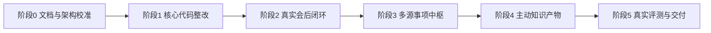

# FeishuAgent 阶段任务规划

## 1. 文档目的

本文档用于区分当前阶段、后续阶段和最终交付目标，避免团队把早期 MVP 误认为完整项目范围。

项目最终目标仍然是完成 `FeishuProject.md` 所要求的 OpenClaw + CLI + 飞书生态主动知识服务系统。MVP 只是验证最小闭环，不代表功能边界收缩。

## 2. 总体阶段

## 3. 阶段0：文档与架构校准

### 目标

统一当前事实、最终目标和阶段边界，避免继续按照过期文档或过窄 MVP 实现。

### 当前状态

进行中。

### 任务

- 更新 `README.md`，说明当前能力、未完成能力和 OpenClaw 主体定位。
- 更新 `架构设计说明书.md`，标注已实现、部分实现、未实现 / 后续演进。
- 更新 `FeishuAgent MVP 审阅整改计划.md`，明确 Trigger.dev 与 OpenClaw 的职责边界。
- 标记过时过程文档。
- 对包含 token 或本地敏感配置的文档脱敏。

### 验收标准

- 文档不再把 MVP 当作最终范围。
- 文档明确 OpenClaw 是 Agent 主体，Trigger.dev 是后台确定性工作流与补偿调度。
- 文档明确 OpenClaw LLM 当前通过 WebSocket Gateway 连接。
- 文档明确 OpenClaw HTTP `/v1/*` 不作为当前主路径。
- 文档明确 `agent-tools` HTTP 服务仍保留，用于 OpenClaw Skill 调用业务工具。

## 4. 阶段1：核心代码整改

### 目标

修复当前实现中的 DRY、开闭原则、正交性和切面治理问题，为后续全量功能扩展打基础。

### 任务

1. 抽应用服务层，消除 `post-meeting` workflow 与 `agent-tools` 的重复流程。
2. 将 tool route 和 event dispatcher 从 `switch` 改成注册表。
3. 将 Base 投影从 `domain` 层移出，放到 workflow / application service。
4. 将卡片发送与 `push_records` 指标记录解耦。
5. 建立统一 execution helper，覆盖 workflow 和 agent-tools。
6. 建立统一 tool error wrapper。
7. 统一 LLM parse/schema 错误处理。
8. 统一 logger 配置来源。

### 验收标准

- 新增工具或事件类型不需要修改核心 dispatcher 结构。
- `domain` 不直接调用飞书外部写回。
- `agent-tools` 异常能返回结构化错误。
- 关键流程都有 execution / audit / push record / metric 记录入口。

## 5. 阶段2：真实会后闭环

### 目标

用真实飞书会议和测试群跑通 B -> D 的核心闭环。

### 任务

1. 准备真实 `meetingId`。
2. 准备可发送卡片的测试群 `chatId`。
3. 准备真实负责人 `open_id`。
4. 跑通会议纪要拉取。
5. 抽取 WorkItem 并入库。
6. 创建飞书任务。
7. 投影到 Base 总表。
8. 发送会后确认卡片。
9. 处理确认 / 驳回 / 修改回调。
10. 记录用户交互数据。

### 验收标准

- 一场真实会议结束后，可以生成事项并进入事项中枢。
- 每条事项保留来源 meetingId。
- 高置信 todo 可以创建飞书任务。
- Base 总表可见最新事项。
- 用户可以通过卡片确认或驳回事项。
- 系统记录工作流执行结果和卡片交互结果。

## 6. 阶段3：多源事项中枢

### 目标

从“会议入口”扩展到最终要求中的多源知识接入，真正形成团队事项中枢。

### 任务

- 接入文档 / Wiki 内容抽取。
- 接入 IM 群消息或消息关键词触发。
- 接入飞书任务状态变化。
- 接入邮件作为事项来源。
- 建立 `source_references`，保留多来源证据。
- 补充跨来源事项归并策略。
- 增加人工确认任务，避免误合并。

### 验收标准

- WorkItem 可以来自 meeting / doc / wiki / im / task / mail。
- 一个 WorkItem 可以关联多个来源引用。
- 重复事项可以归并而不是重复创建。
- 用户可以追溯每条事项的来源证据。

## 7. 阶段4：主动知识产物

### 目标

完成赛题要求的主动服务能力，不局限在会后抽取，而是分散记录待办的“收集器”，而是一个“团队重点事项追踪表自动维护器”。它能周期性地从飞书文档内容、文档评论、会议纪要、飞书任务等来源识别并汇总团队重点事项中的各类 Todo，自动整理进统一表格，补齐负责人、优先级、截止时间和关联背景链接；同时持续同步任务进展、最新状态和阻塞原因，帮助团队形成一份可追踪、可分派、可预警的“重点事项推进总表”。

### 任务

- 会前背景卡片。
- 风险预警卡片。
- 周期性管理洞察。
- CLI / 开发者即时知识推送。
- 事项驱动的任务摘要和团队报告。
- OpenClaw 自然语言入口稳定调用工具。
- 周期性地从飞书文档内容、文档评论、会议纪要、飞书任务等来源识别并汇总团队重点事项中的各类 Todo，自动整理进统一表格，补齐负责人、优先级、截止时间和关联背景链接；
- 同时持续同步任务进展、最新状态和阻塞原因，帮助团队形成一份可追踪、可分派、可预警的“重点事项推进总表”。
- 事件中枢的可视化。

### 验收标准

- 会议开始前能主动推送背景知识。
- 事项超期或阻塞时能主动提醒。
- 每周能生成管理洞察。
- OpenClaw 能根据用户自然语言选择合适工具。
- 知识产物与 WorkItem / SourceReference 关联。

## 8. 阶段5：真实评测与最终交付

### 目标

完成 `FeishuProject.md` 要求的效果验证和最终交付文档。

### 任务

- 选取 3-5 场真实会议做人工标注。
- 计算事项抽取 Precision / Recall / F1。
- 统计负责人推断准确率。
- 统计卡片确认率、驳回率、修改率。
- 统计任务认领率或完成率。
- 对比人工整理耗时和系统整理耗时。
- 生成最终效果验证报告。
- 整理交付文档包。

### 验收标准

- 效果报告基于真实样本，而不是模拟数据。
- 关键结论均可追溯来源。
- 能证明准确性、用户接受度和效率提升。
- 最终文档清晰区分需求、架构、运行说明和效果验证。

## 9. 不应偏移的原则

- 不把 Trigger.dev 当作项目主体。Trigger.dev 是后台工作流、调度、重试和补偿基础设施。
- 不把当前 MVP 当作最终目标。MVP 只是验证最小闭环。
- 不把 OpenClaw 降级为普通 LLM API。OpenClaw 应负责意图理解、场景选择、工具调用和结果表达。
- 不把 Base 总表当作唯一成果。Base 是事项中枢的一个投影，核心仍是 WorkItem + SourceReference + KnowledgeArtifact。
- 不用模拟数据替代最终效果验证。

## 10. 当前需要用户提供的真实资源

进入阶段2前，需要准备：

- 一个真实会议 `meetingId`。
- 一个可接收测试卡片的群 `chatId`。
- 至少 1-3 个测试负责人 `open_id`。
- 可用于 Base 总表写入的 `FEISHU_BASE_TOKEN` 和 `FEISHU_BASE_TABLE_ID`。
- 用于最终评测的 3-5 场会议样本。

