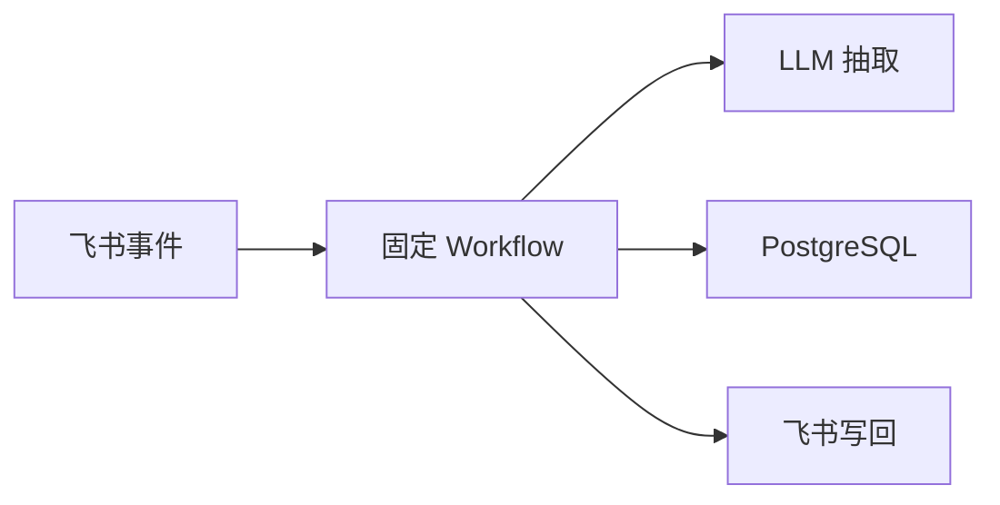
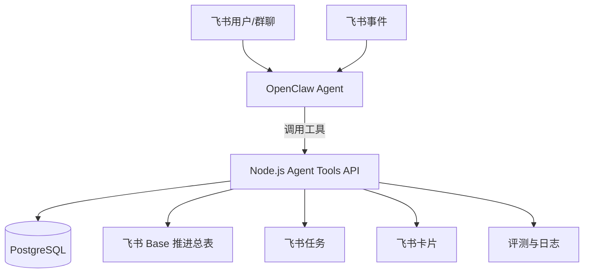

# OpenClaw 主体化方案

## 1. 当前问题

当前实现中，OpenClaw/LLM 主要承担“文本理解与结构化抽取”能力，系统主体仍是固定工作流：



这能保证可控、可观测，但 OpenClaw 占比偏低，容易被评审理解为“普通后端服务 + LLM 调用”，没有充分体现赛题中“利用 OpenClaw”的要求。

## 2. 调整目标

把 OpenClaw 从“模型调用者”提升为“办公 Agent 主体”，但不放弃服务端的确定性状态管理。

调整后的定位：

| 层次 | 主体 | 职责 |
| --- | --- | --- |
| Agent 主体 | OpenClaw | 理解用户意图、选择场景、解释结果、触发工具 |
| 业务内核 | Node.js 服务 | 事项状态机、数据库、对账、幂等、审计、评测 |
| 飞书执行 | lark-cli / 飞书 API | 读取会议/文档/任务，写任务/Base/卡片 |

## 3. 新架构



关键变化：
- OpenClaw 负责“判断该做什么”，而不是仅作为 LLM。
- Node.js 服务暴露工具 API，供 OpenClaw 调用。
- 固定 workflow 降级为后台保障任务：定时对账、风险巡检、补偿。

## 4. OpenClaw 工具接口设计

建议新增一个 `agent-tools` API 层，面向 OpenClaw 暴露少量高价值工具：

### 4.0 HTTP 与 WebSocket 边界

当前需要区分两条链路：

| 链路 | 当前结论 | 说明 |
| --- | --- | --- |
| OpenClaw Gateway WebSocket | 保留，作为 Agent / LLM 主路径 | `src/domain/openclaw-client.ts` 已通过 WebSocket Gateway + device auth 调用 `agent` RPC |
| OpenClaw HTTP `/v1/*` | 不作为当前主路径 | 旧验证中存在 token scope 问题，且当前实现已明确不再 fallback 到 HTTP `/v1/*` 或 DeepSeek |
| `agent-tools` HTTP API | 保留 | 这是 OpenClaw Skill 调用 FeishuAgent 业务工具的本地服务接口，不等同于 OpenClaw Gateway HTTP |

因此，后续不应继续围绕 OpenClaw HTTP `/v1/*` 排障作为主线。除非后续迁移到 OpenClaw Gateway 原生 tool RPC，否则 `agent-tools` HTTP API 仍是必要桥接层。

### `extractMeetingItems`

从会议纪要中抽取事项并写入事项中枢。

```json
{
  "meetingId": "xxx",
  "chatId": "xxx"
}
```

返回：

```json
{
  "savedCount": 5,
  "baseUrl": "https://xxx",
  "items": [
    { "id": "uuid", "title": "完成接口联调", "owner": "张三", "status": "active" }
  ]
}
```

### `syncWorkItemHub`

同步事项中心、飞书任务和 Base 总表。

```json
{ "limit": 200 }
```

### `inspectRisks`

巡检超期、阻塞、长期未推进事项。

```json
{ "sendAlerts": true }
```

### `queryWorkItems`

按负责人、状态、风险等级查询事项。

```json
{
  "owner": "张三",
  "status": ["active", "blocked"]
}
```

## 5. Workflow 的新角色

固定 workflow 不取消，但角色收缩：

| 原角色 | 新角色 |
| --- | --- |
| 主动决策所有流程 | 只负责后台确定性任务 |
| 直接承载所有业务入口 | 作为 OpenClaw 工具的底层实现 |
| 用户不可见 | 为 OpenClaw 提供稳定、可审计的动作 |

保留 workflow 的原因：
- 定时任务和补偿必须可重复执行。
- 任务状态对账不能完全依赖 Agent 即兴判断。
- 评测报告需要稳定执行记录。
- Trigger.dev 负责可靠调度、重试和后台对账，不负责取代 OpenClaw 的 Agent 主体地位。

## 6. 推荐实施顺序

### 阶段一：保留现有流程，完成 D 主线

已完成：
- 会后事项抽取
- WorkItem 入库
- 飞书任务创建
- Base 推进总表
- 状态对账
- 风险巡检

### 阶段二：新增 OpenClaw 工具 API

新增：
- `src/agent-tools/server.ts`
- `src/agent-tools/routes.ts`
- `src/agent-tools/openclaw-tool-manifest.json`
- `src/agent-tools/auth.ts`
- `src/agent-tools/schemas.ts`

让 OpenClaw 可以通过 Skill 调用 Node.js 服务。当前桥接方式是 `agent-tools` HTTP API；这不是 OpenClaw Gateway HTTP `/v1/*` 调用路径。

已实现工具：
- `extractMeetingItems`
- `syncWorkItemHub`
- `inspectRisks`
- `queryWorkItems`
- `summarizeWorkItemHub`

工具调用地址默认是 `http://127.0.0.1:8787`，鉴权方式是：

```text
Authorization: Bearer <AGENT_TOOLS_TOKEN>
```

### 阶段三：把用户入口迁移到 OpenClaw

用户不再直接触发固定 workflow，而是在飞书中对 OpenClaw 说：

- “同步一下重点事项总表”
- “帮我检查本周有哪些阻塞事项”
- “把昨天会议里的待办都整理出来”
- “给李华发一下他超期的事项”

OpenClaw 根据意图选择工具调用。

系统提示词已放在：

- `src/openclaw/system-prompt.md`

配置 OpenClaw Agent 时，应把该提示词作为系统指令，让 Agent 优先调用工具而不是凭空回答。

## 7. 最终对外表达

项目不是“固定工作流系统”，而是：

> 一个由 OpenClaw 驱动的飞书办公 Agent。OpenClaw 负责理解办公场景、选择工具和组织反馈；后端事项中枢负责沉淀状态、保证幂等、执行对账和支撑评测。

这样既满足“以 OpenClaw 为主体”，又保留工程可控性。
