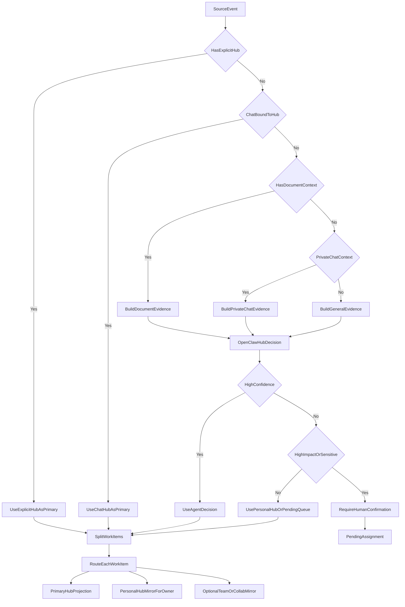
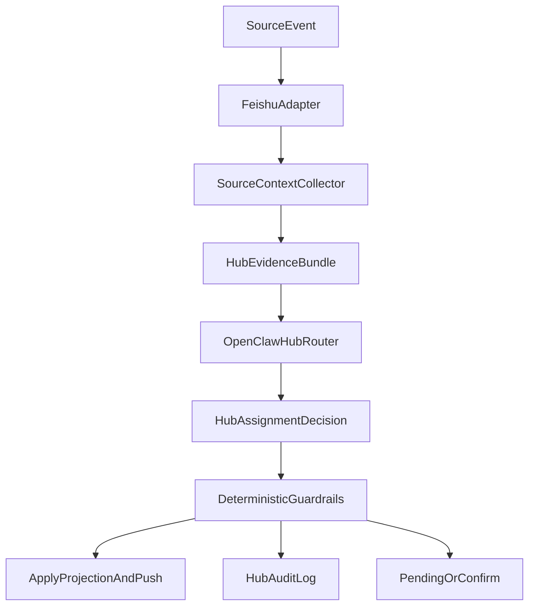

# WorkItem Hub 归属边界条件设计

## 1. 文档目的

本文用于沉淀多源知识抽取场景下 WorkItem 的来源归属、Hub 投影和用户触达边界。

当前先约定：使用机器人的用户都属于同一个飞书租户或组织。因此本文暂不讨论跨租户鉴权和数据隔离，只讨论同一租户下多个群、多个团队、多个 Hub 之间的事项归属问题。

本文是持续优化中的设计基线，后续可继续补充更多边界条件。

## 2. 核心概念

### 2.1 WorkItem 真源

`work_items` 应作为事项的全局真源，记录事项本身的标题、状态、负责人、截止时间、优先级、来源等信息。

WorkItem 不应直接等同于某个飞书群、某个 Base 行或某个用户视图。飞书 Base、团队 Hub、个人 Hub、协作 Hub 都只是同一 WorkItem 在不同上下文中的投影。

### 2.2 Hub

Hub 是事项中枢的上下文视图，建议包括以下类型：

- 团队 Hub：对应一个稳定团队、群或项目组。
- 个人 Hub：某个用户相关事项的个人聚合视图。
- 协作 Hub：跨团队、跨群、跨项目的临时或长期协作上下文。
- 默认或遗留 Hub：用于兼容现有单 Hub / 单 Base 实现。

Hub 不等同于飞书群。飞书群可以绑定 Hub，但 Hub 的语义应是“事项协作上下文”，而不是“聊天容器”。

### 2.3 投影

同一个 WorkItem 可以被投影到多个 Hub。

建议区分投影角色：

- `primary`：事项的主要归属 Hub。
- `mirror_owner`：因为负责人属于某个个人 Hub 或团队 Hub 而产生的镜像。
- `mirror_participant`：因为协作者、关注者或参与者而产生的镜像。
- `mirror_collaboration`：因为跨团队协作而产生的镜像。

`primary` 只能有一个，镜像可以有多个。

### 2.4 用户触达

用户触达不等同于 Hub 可见性。

用户是否收到卡片、私聊、任务提醒，应主要由以下因素决定：

- 用户是否是 WorkItem owner。
- 用户是否是 collaborator、participant、watcher。
- 用户是否被显式 @、指派或确认。
- 用户是否是需要确认归属的 leader 或会议发起人。

仅仅因为用户是某个 Hub 成员，不应默认收到每条事项的个人推送。

## 3. 总体原则

### 3.1 来源上下文决定 primary Hub

会议、文档、IM、任务、邮件等来源事件应先解析出来源上下文。来源上下文决定 WorkItem 默认进入哪个 primary Hub。

例如：

- A 群会议产生的事项，默认 primary Hub 是 A Hub。
- A 群 IM 消息抽取出的事项，默认 primary Hub 是 A Hub。
- 某个明确绑定到项目 Hub 的文档产生的事项，默认 primary Hub 是该项目 Hub。

### 3.2 负责人和参与者决定个人触达

WorkItem 的 owner、collaborator、participant、watcher 决定个人 Hub 镜像和个人推送。

例如：

- A Hub 的事项指派给用户 1，则用户 1 的个人 Hub 应出现该事项。
- 用户 1 是否属于 B 群，不应导致该事项自动进入 B Hub。

### 3.3 群成员关系不自动扩散事项

同一租户下，用户可能同时属于多个群或团队。用户的群成员关系不能作为事项向其他 Hub 扩散的充分条件。

例如：

- B 群成员 1 参加 A 群会议。
- A 群会议产生的事项如果指派给 1，应触达 1，并进入 1 的个人 Hub。
- 但该事项不应因为 1 属于 B 群而自动进入 B Hub。

### 3.4 WorkItem 分发应按事项粒度，而不是会议粒度一刀切

一个会议可能产生多条 WorkItem。不同 WorkItem 可能有不同负责人、不同相关团队和不同可见范围。

因此会议层面只提供默认上下文，最终归属应允许按每条 WorkItem 调整。

### 3.5 低置信归属进入确认流程

当系统无法高置信判断 Hub 归属时，不应盲目广播到多个 Hub。应进入确认流程，由会议发起人、相关 leader 或 Hub 管理员确认。

### 3.6 OpenClaw 应承担上下文判定，而不是只依赖硬规则

本文中的规则不应被理解为全部由确定性代码硬编码。FeishuAgent 的主体仍是 OpenClaw 驱动的办公知识 Agent。

合理分工应是：

- 确定性代码负责收集事实：事件来源、群聊上下文、文档位置、显式绑定、参会人、编辑者、评论者、@对象、历史 Hub 关系。
- OpenClaw 负责综合上下文做归属判断：判断事项更像团队事项、个人事项、协作事项，选择 primary Hub、镜像 Hub 和触达对象。
- 确定性代码负责执行和审计：根据 OpenClaw 决策写入 WorkItem、投影 Hub、发送推送、记录证据和置信度。
- 人工确认只用于低置信、高影响或权限敏感场景，不能成为所有边界情况的默认路径。

因此，归属流程应优先是“规则给候选集，OpenClaw 做判定”，而不是“规则不能覆盖就全部交给人”。

## 4. 会议来源界定规则

会议来源建议按以下优先级判断：

1. 显式 Hub 绑定。
2. 日历、群聊或事件 payload 中的 chat / group 上下文。
3. 文档、议程、标题或会议描述中的项目 / 团队线索。
4. 参会人结构推断。
5. 人工确认。

### 4.1 显式 Hub 绑定优先

如果会议、日程、机器人指令或会议记录已经显式绑定 Hub，则直接使用该 Hub 作为 primary Hub。

示例：

- `/bind-hub A`
- `/bind-hub A B`
- `/create-collab-hub 项目X联调`
- 日程描述中显式包含项目 Hub 标识。

### 4.2 群或日历上下文次之

如果会议从 A 群发起，或事件 payload 能稳定得到 A 群 `chat_id`，且该 `chat_id` 已绑定 A Hub，则默认 primary Hub 是 A Hub。

如果会议来自飞书日历，但没有群上下文，则可根据日历组织者、参会人、会议标题、日程描述等信息推断候选 Hub。

### 4.3 参会人结构只作为推断信号

参会人结构可以帮助判断会议是否跨团队，但不应单独决定事项向多个 Hub 广播。

例如：

- A、B 两个 leader 同时参会。
- A、B 双方多个技术骨干参会。
- 会议标题或内容出现双方接口、联调、验收等词。

这些信号可以生成 `candidate_hub_ids=[A,B]`，但不应直接让所有 WorkItem 同时进入 A Hub 和 B Hub。

### 4.4 需要记录归属置信度

建议为来源归属记录置信度和证据：

- `source_hub_id`
- `candidate_hub_ids`
- `collaboration_hub_id`
- `assignment_confidence`
- `assignment_evidence`

高置信时自动投影，低置信时进入确认流程。

## 5. 场景规则

### 5.1 A 群会议，B 群成员参加

场景：

- A 群开会。
- B 群成员 1 参加会议。
- 会议产生 WorkItem。

规则：

- 会议来源是 A 群，因此 WorkItem 默认 primary Hub 是 A Hub。
- 如果 WorkItem 指派给 1，或 1 是明确协作者，则应触达 1。
- 1 的个人 Hub 应出现该事项镜像。
- B Hub 不应自动收到该事项。

只有满足以下条件之一时，B Hub 才应收到镜像：

- WorkItem 明确属于 B 的职责范围。
- 会议或事项明确标记为 A/B 协作。
- A 或 B 的 leader / Hub 管理员确认同步到 B Hub。
- 存在显式协作 Hub，且 B Hub 需要镜像相关事项。

### 5.2 A 群内部会议，A 成员未到场

场景：

- A 群内部会议。
- A 群某成员没有参加。
- 会议产生 WorkItem。

规则：

- WorkItem 默认进入 A Hub。
- 未参会成员不会因为是 A Hub 成员而收到个人推送。
- 如果该未参会成员被明确指派为 owner 或 collaborator，则应触达该成员。
- 如果该未参会成员只是普通 A Hub 成员，则可在 A Hub 中看到事项，但不需要收到个人卡片。

结论：

- A Hub 会收到该 WorkItem。
- A Hub 成员是否个人收到推送，取决于其是否与该 WorkItem 有明确责任关系。

### 5.3 A、B 群合作，双方 leader 和技术骨干临时拉会

场景：

- A、B 两个团队合作。
- A、B 两个 leader 以及双方技术骨干临时拉会。
- 会议产生多个 WorkItem。

规则：

- 如果会议显式绑定协作 Hub，则协作 Hub 是 primary Hub。
- 如果会议从 A 群发起但明确是 A/B 协作，则 A Hub 可以作为来源 Hub，但应提示创建或选择协作 Hub。
- 如果没有显式上下文，但参会结构明显跨团队，则系统应生成 `candidate_hub_ids=[A,B]`，并进入低置信确认或协作 Hub 建议。

WorkItem 应按事项粒度分发：

- “A 负责补接口文档”：进入 A Hub，负责人个人 Hub 收到镜像。
- “B 负责改鉴权逻辑”：进入 B Hub，负责人个人 Hub 收到镜像。
- “双方完成联调验收”：进入协作 Hub，并可镜像到 A Hub 和 B Hub。
- “待确认技术方案”：如果 owner 不明确，进入协作 Hub 的待认领状态。

不建议因为双方都有人参会，就把所有事项无差别同步到 A Hub 和 B Hub。

### 5.4 A 群少数人快速会议

场景：

- A 群中 3 个人就一个小问题快速开会。
- 会议拆分出若干 WorkItem。

规则：

- 如果问题属于 A 群的工作范围，则 WorkItem 应进入 A Hub。
- 负责人或协作者收到个人触达。
- A 群其他未参会成员不收到个人推送，但可以在 A Hub 看到。
- 默认不创建临时协作 Hub。

理由：

- 少数人快速会议通常不是新的协作边界，只是 A Hub 内部工作的细分讨论。
- 默认创建临时 Hub 会导致 Hub 碎片化，增加权限、投影、搜索和归档成本。

### 5.5 什么时候创建协作 Hub

协作 Hub 不应作为每场小会的默认容器，而应在存在明确协作边界时创建。

适合创建协作 Hub 的情况：

- 会议没有明确归属于已有 A/B/C Hub。
- 参与者来自多个 Hub，且事项需要双方共同维护。
- 事项有独立生命周期，例如专项、故障、客户交付、版本发布。
- 需要独立成员范围，不希望整个 A Hub 或 B Hub 都看到。
- 后续会持续产生多条 WorkItem、文档、会议、风险记录。

不适合创建协作 Hub 的情况：

- 单一团队内部的小范围快速会议。
- 已经明确属于某个团队 Hub 的问题拆分。
- 只有一条短生命周期事项，且 owner 明确。
- 只是某个外部成员临时旁听或提供信息。

### 5.6 临时协作 Hub 的生命周期

如果创建临时协作 Hub，建议使用自动归档，而不是物理删除。

建议规则：

- 创建条件：显式指令，或系统建议后由 leader / Hub 管理员确认。
- 活跃条件：存在未完成 WorkItem、未关闭风险、待确认事项或近期来源事件。
- 归档条件：所有未完成 WorkItem 已关闭，且超过冷却期没有新事件。
- 归档动作：Hub 状态变为 `archived`，保留 source references、审计日志、最终摘要和 Base 投影记录。
- 可见性：归档摘要可镜像回相关团队 Hub。

不建议自动物理删除临时 Hub，因为删除会破坏事项追溯、审计和效果评估。

### 5.7 单聊 / 私聊 IM 来源

场景：

- 同一租户内 2 个及以上用户通过飞书单聊或私聊讨论事项。
- 消息、@机器人或机器人指令触发 WorkItem 抽取。
- 没有群上下文。
- 没有显式 Hub 绑定。

核心冲突：

- 无法通过 `chat_id -> hub_id` 匹配团队 Hub。
- 单聊双方都可能是责任方。
- 单聊内容可能是个人协作，也可能是某个团队项目的补充讨论。
- primary Hub 没有天然默认值。

建议规则：

- 如果消息中有显式 Hub 指令或项目标识，则优先使用该 Hub。
- 如果 WorkItem 明确指派给某个用户，但没有团队上下文，则 primary Hub 可先落到该 owner 的个人 Hub。
- 如果双方分别属于不同团队，且内容明显是跨团队事项，则由 OpenClaw 判断是否创建或使用协作 Hub。
- 如果内容只是个人之间的轻量协作，不应强行进入任一团队 Hub。
- 如果内容明显属于某个已有团队事项的后续讨论，应关联到已有 WorkItem，并继承原 WorkItem 的 primary Hub。

OpenClaw 判定时应综合：

- 消息正文是否出现项目、团队、文档、任务、会议或历史 WorkItem 线索。
- 双方用户的 Hub 成员关系和历史协作关系。
- 是否存在被引用的飞书任务、文档、会议或 Base 记录。
- 是否有明确 owner、due date、action verb。
- 是否需要团队可见，还是只需要个人待办。

默认行为：

- 无显式 Hub、无团队线索、只有明确个人责任时，进入 owner 个人 Hub。
- 无 owner、无团队线索、但确实抽取出事项时，进入参与者的个人待确认队列，而不是进入团队 Hub。
- 有跨团队线索但置信度不足时，OpenClaw 先给出候选 Hub 和理由，再仅向相关责任人或 leader 请求确认。

不建议行为：

- 不应把所有单聊事项写入默认团队 Hub。
- 不应因为双方分别属于 A、B 团队，就同时写入 A Hub 和 B Hub。
- 不应把单聊内容默认暴露给任一团队 Hub，除非有明确业务上下文或 OpenClaw 高置信判断。

### 5.8 文档未显式绑定 Hub，但存放在 A 团队专属云空间

场景 A：

- 文档没有显式绑定 Hub。
- 文档存放在 A 团队专属云空间、文件夹或知识库节点下。
- 编辑者包含 A、B 团队成员。
- 系统从文档正文或评论中抽取 WorkItem。

规则：

- 文档所在空间、文件夹或知识库节点是强来源信号。
- 如果该云空间明确属于 A 团队，则默认 source Hub 是 A Hub。
- B 团队成员参与编辑，不应自动让事项进入 B Hub。
- 如果某条 WorkItem 明确由 B 团队成员负责，则该成员个人 Hub 应收到镜像。
- 如果正文表达事项属于 B 团队职责，OpenClaw 可以将该条 WorkItem 的 responsible Hub 判为 B Hub，并把 B Hub 作为镜像或 primary Hub。

建议默认：

- 文档级 primary Hub 先继承 A Hub。
- WorkItem 级归属由 OpenClaw 根据正文、评论、owner、@对象和历史上下文细分。
- 如果文档长期由 A/B 双方共同维护，OpenClaw 可建议绑定协作 Hub，而不是每次抽取都重新推断。

### 5.9 文档绑定 A Hub，但被转发到 B 群后新增内容

场景 B：

- 文档已经绑定 A Hub。
- 文档被转发到 B 群。
- B 群成员在文档中新增内容或评论，并触发事项抽取。

核心冲突：

- 文档绑定指向 A Hub。
- 触发行为和新增内容来自 B 群成员。
- 事项可能是 A 文档中的补充，也可能是 B 团队新增的责任。

规则：

- 显式文档绑定优先于转发上下文，因此默认 source Hub 仍是 A Hub。
- B 群转发只作为传播和参与证据，不自动改变文档归属。
- B 成员新增内容如果明确提出 B 的行动项，可以让该条 WorkItem 进入 B 负责人个人 Hub，并由 OpenClaw 判断是否镜像到 B Hub。
- 如果新增内容改变了文档协作边界，例如形成 A/B 联合交付事项，则 OpenClaw 应建议将该文档绑定到协作 Hub，或为相关事项创建协作 Hub 投影。

不建议行为：

- 不应因为文档被转发到 B 群，就把文档内所有事项同步到 B Hub。
- 不应因为新增者是 B 成员，就直接把整篇文档的 source Hub 改为 B Hub。
- 不应覆盖原有 A Hub 绑定，除非管理员或 OpenClaw 高置信确认这是文档归属迁移。

### 5.10 文档评论 @ 消息与正文抽取的归属一致性

场景 C：

- 同一文档中，正文抽取出 WorkItem。
- 文档评论或评论 @ 消息也抽取出 WorkItem。
- 两类来源可能指向相同事项，也可能产生不同事项。

规则：

- 评论 @ 消息与正文抽取应共享同一个文档级来源上下文。
- 如果文档显式绑定 A Hub，正文和评论默认都继承 A Hub。
- 如果文档未绑定 Hub，则正文和评论都应使用同一套文档来源推断：空间、文件夹、知识库节点、所有者、历史绑定、编辑者结构。
- 评论中的 @ 对象主要影响 owner、collaborator、watcher 和个人触达，不应单独改变文档的 source Hub。

差异处理：

- 正文更适合判断事项所属主题和长期归属。
- 评论更适合判断即时责任人、补充上下文、阻塞点和确认动作。
- 如果评论 @ 明确把事项转交给另一个团队，OpenClaw 可以在 WorkItem 级别调整 responsible Hub 或新增镜像 Hub。
- 如果评论只是提醒某人查看，不应把被 @ 人所在团队自动加入 Hub 投影。

归并规则：

- 评论抽取出的事项如果与正文 WorkItem 语义相同，应合并为同一 WorkItem，并新增 `source_reference`。
- 合并后 primary Hub 保持原 WorkItem 的 primary Hub。
- 评论可更新 owner、participants、status、due date 或 evidence，但不应轻易迁移 primary Hub。
- 若评论明确表达事项归属发生变化，应由 OpenClaw 给出迁移决策和证据，必要时进入高影响确认。

## 6. 推荐决策流程



## 7. 推荐数据与状态字段

### 7.1 来源归属字段

建议为来源事件或来源引用保存：

- `origin_channel`
- `origin_context_id`
- `source_hub_id`
- `candidate_hub_ids`
- `collaboration_hub_id`
- `assignment_confidence`
- `assignment_evidence`
- `agent_decision_reason`
- `agent_decision_model`

### 7.2 WorkItem 责任字段

建议 WorkItem 或关联表表达：

- `owner_user_id`
- `owner_source`
- `participants`
- `collaborators`
- `watchers`
- `responsible_hub_id`
- `hub_assignment_source`

其中 `responsible_hub_id` 可表示该事项业务责任主要落在哪个团队 Hub，不一定等同于来源 Hub。

`hub_assignment_source` 可表示 Hub 归属来自显式绑定、群上下文、文档空间、OpenClaw 判定、人工确认或继承已有 WorkItem。

### 7.3 Hub 投影字段

建议 `work_item_hub_projections` 至少包含：

- `work_item_id`
- `hub_id`
- `projection_role`
- `created_reason`
- `created_by`
- `visibility`
- `external_record_id`

### 7.4 确认状态

建议为低置信事项提供确认状态：

- `pending_hub_assignment`
- `pending_owner_assignment`
- `confirmed`
- `rejected`
- `archived`

## 8. 推送边界

### 8.1 应推送给个人的情况

- 用户是 WorkItem owner。
- 用户是明确 collaborator。
- 用户被会议纪要、消息、文档评论明确 @ 或指派。
- 用户需要确认 Hub 归属、owner 归属或跨团队同步。
- 用户订阅了该事项或被设置为 watcher。

### 8.2 不应默认个人推送的情况

- 用户只是 Hub 普通成员。
- 用户只是所在群有人参加了会议。
- 用户只是属于某个参会人的其他群。
- 用户没有参加会议，且没有被指派。
- 用户所属团队与事项没有明确业务责任。

### 8.3 应进入 Hub 但不个人推送的情况

- A Hub 内部事项，A Hub 成员可见，但只推送给 owner / collaborator。
- 团队会议产生的背景型事项，没有明确个人责任。
- 低优先级、待确认或仅供追踪的事项。

## 9. 当前建议结论

当前设计建议采用以下一句话原则：

> 来源上下文和 OpenClaw 判定共同决定 primary Hub；负责人和参与者决定个人触达；用户所属的其他群不自动获得可见性；跨团队协作按事项粒度投影；人工确认只处理低置信、高影响或权限敏感场景。

对几个核心边界的结论：

- A 群会议中 B 成员参会：事项默认进 A Hub；如指派给 B 成员，则触达该成员和其个人 Hub；不自动进 B Hub。
- A 群会议中 A 成员未参会：事项默认进 A Hub；未参会成员不个人推送，除非被指派。
- A/B 合作临时会议：优先识别或创建协作 Hub；每条 WorkItem 按 owner、team、topic 分发；不对 A/B Hub 做无差别广播。
- A 群少数人快速会议：默认进入 A Hub；不默认创建临时协作 Hub。
- 临时协作 Hub：用于跨边界和独立生命周期场景；完成后自动归档，不物理删除。
- 单聊 / 私聊 IM：无显式 Hub 时优先由 OpenClaw 判断；个人事项进入个人 Hub，团队事项继承已有上下文或候选 Hub，不默认进入团队 Hub。
- 文档来源：显式绑定优先，其次文档所在空间 / 文件夹 / 知识库节点；编辑者或转发群只作为责任和协作证据，不自动改变 source Hub。
- 文档评论 @：默认继承文档级来源上下文；@对象影响责任人和触达，不自动让被 @ 人所在 Hub 获得可见性。

## 10. 待继续讨论的问题

- 如何从飞书会议事件中稳定获得发起群、日历组织者和参会人结构。
- 如何维护用户到团队 Hub 的关系，尤其是一个用户属于多个 Hub 时的优先级。
- 协作 Hub 是由系统自动建议，还是必须由 leader 显式创建。
- `responsible_hub_id` 是否应进入 WorkItem 主表，还是只通过投影和 participant 关系表达。
- 低置信归属确认卡片应该发给会议发起人、双方 leader，还是当前 Hub 管理员。
- 已归档临时 Hub 的摘要应如何回写到团队 Hub 或知识产物。
- 单聊场景中，个人 Hub 的待确认队列是否需要和正式 WorkItem 状态分离。
- OpenClaw 的 Hub 判定需要哪些最小上下文包，如何控制 token 成本和隐私边界。
- OpenClaw 高置信自动决策的阈值如何设定，哪些操作必须人工确认。
- 文档所在云空间、知识库节点和文件夹到 Hub 的绑定关系如何维护。
- 文档评论导致 WorkItem 归属迁移时，是否需要原 Hub 管理员确认。

## 11. 具体实现方案

### 11.1 总体架构

Hub 归属不应只靠静态规则，也不应把所有模糊情况都交给人工。推荐实现为“确定性证据收集 + OpenClaw 结构化决策 + 确定性执行与审计”。



职责分工：

- `FeishuAdapter`：把会议、IM、文档、评论等飞书事件标准化，提取 `origin_channel`、`origin_context_id`、`chat_id`、`actor_open_id`、`doc_token`、`calendar_event_id` 等。
- `SourceContextCollector`：通过数据库和 lark-cli 拉取上下文事实，生成证据包。
- `OpenClawHubRouter`：基于证据包判断 primary Hub、responsible Hub、mirror Hub、owner 和触达对象。
- `DeterministicGuardrails`：执行不可越权的硬约束，例如显式绑定优先、私聊不默认进团队 Hub、低置信高影响操作必须确认。
- `ApplyProjectionAndPush`：写入 WorkItem、Hub 投影、个人镜像、Base 投影和推送记录。
- `HubAuditLog`：记录 OpenClaw 的决策理由、证据、置信度和最终动作。

### 11.2 是否需要编写 Skill

需要，但建议写的是项目内 OpenClaw 业务 Skill，而不是单独的 lark-cli 通用 Skill。

推荐新增一个 OpenClaw Skill / 场景能力：`workitem-hub-router`。

它的职责不是直接操作飞书，而是让 OpenClaw 在 FeishuAgent 的业务边界内完成 Hub 归属判定。

建议包含以下工具或 agent-tools endpoint：

- `collectSourceContext`：输入事件 ID、来源类型和资源 token，返回标准化证据包。
- `listCandidateHubs`：根据 chat、user、doc、calendar、历史事项查询候选 Hub。
- `decideWorkItemHub`：让 OpenClaw 输出结构化 `HubAssignmentDecision`。
- `applyHubAssignment`：由 Node 侧执行 OpenClaw 决策，写投影、推送和审计。
- `explainHubAssignment`：面向用户解释某个事项为什么进入某个 Hub。

不建议让 OpenClaw 在运行时自由裸调所有 lark-cli 命令。更稳妥的方式是：Node 侧只把必要事实整理成证据包交给 OpenClaw，避免 token 浪费、权限扩散和隐私泄露。

### 11.3 OpenClaw 的输入：HubEvidenceBundle

OpenClaw 判断 Hub 归属时，应接收结构化证据包，而不是原始飞书 payload。

建议结构：

```json
{
  "source": {
    "originChannel": "meeting",
    "originContextId": "meeting_xxx",
    "sourceUrl": "https://...",
    "eventType": "vc.meeting.meeting_ended_v1"
  },
  "explicitBindings": {
    "hubIds": [],
    "docBoundHubId": null,
    "chatBoundHubId": null,
    "calendarBoundHubId": null
  },
  "resourceContext": {
    "chatId": "oc_xxx",
    "chatType": "group",
    "chatName": "A项目群",
    "calendarEventId": "event_xxx",
    "calendarOrganizerOpenId": "ou_xxx",
    "docToken": "doxcn_xxx",
    "docOwnerOpenId": "ou_xxx",
    "wikiSpaceId": "space_xxx",
    "folderToken": "fldcn_xxx"
  },
  "peopleContext": {
    "actorOpenId": "ou_xxx",
    "participants": [],
    "attendees": [],
    "mentionedUsers": [],
    "editors": [],
    "commentAuthors": []
  },
  "candidateHubs": [
    {
      "hubId": "uuid",
      "hubType": "team",
      "name": "A Hub",
      "matchedBy": ["chat_binding", "member_owner"],
      "membersInvolved": ["ou_xxx"],
      "priorScore": 0.82
    }
  ],
  "contentSignals": {
    "title": "接口联调问题拆分",
    "excerpt": "A负责补接口文档，B负责改鉴权逻辑",
    "mentionedTeams": ["A", "B"],
    "actionVerbs": ["负责", "完成", "验收"],
    "sensitive": false
  },
  "similarWorkItems": [
    {
      "workItemId": "item_xxx",
      "primaryHubId": "uuid",
      "similarityReason": "same doc and same topic"
    }
  ]
}
```

### 11.4 OpenClaw 的输出：HubAssignmentDecision

OpenClaw 必须输出可校验 JSON，不应只输出自然语言。

建议结构：

```json
{
  "primaryHubId": "uuid-or-null",
  "responsibleHubId": "uuid-or-null",
  "mirrorHubIds": ["uuid"],
  "personalMirrorUserIds": ["ou_xxx"],
  "ownerCandidates": [
    {
      "openId": "ou_xxx",
      "confidence": 0.86,
      "reason": "comment @ and action verb"
    }
  ],
  "assignmentType": "team_primary",
  "confidence": 0.84,
  "impactLevel": "medium",
  "requiresHumanConfirmation": false,
  "decisionReason": "文档绑定 A Hub，但该条评论明确把鉴权改造指派给 B 成员，因此 primary 仍为 A Hub，B 成员个人 Hub 镜像，B Hub 仅作为可选镜像。",
  "evidenceRefs": ["chat_binding:A", "doc_binding:A", "mention:ou_xxx"],
  "fallbackAction": null
}
```

`assignmentType` 建议枚举：

- `explicit_hub`
- `chat_primary`
- `doc_primary`
- `calendar_primary`
- `personal_primary`
- `collaboration_primary`
- `inherit_existing_item`
- `pending_assignment`

### 11.5 自动决策阈值

建议使用置信度和影响等级共同决定是否自动执行。

- `confidence >= 0.78` 且非高影响：自动执行。
- `0.55 <= confidence < 0.78`：低影响事项可进入个人 Hub 或待确认队列；涉及团队 Hub 可见性变化时请求确认。
- `confidence < 0.55`：不写入团队 Hub，只进入 pending 或请求确认。
- 高影响操作即使置信度较高，也需要 guardrails 判断是否确认。

高影响操作包括：

- 把私聊内容投影到团队 Hub。
- 把 A Hub 文档事项同步到 B Hub。
- 迁移已有 WorkItem 的 primary Hub。
- 创建新的协作 Hub 并邀请成员。
- 向整个团队群推送卡片。
- 涉及敏感关键词、客户、绩效、人事或权限材料。

低影响操作可以自动完成：

- 进入 owner 个人 Hub。
- 继承已有 WorkItem 的 primary Hub。
- 在已有 primary Hub 内新增 source reference。
- 给明确 owner 发送个人确认卡。

### 11.6 确定性 Guardrails

OpenClaw 可以做判断，但不能越过系统硬约束。

必须保留的硬约束：

- 显式绑定 Hub 优先，除非管理员确认迁移。
- 单聊 / 私聊内容不默认进入团队 Hub。
- 用户属于某个团队，不代表其所有私聊和参会事项都进入该团队 Hub。
- 文档被转发到某群，不改变文档原始 Hub 绑定。
- 评论 @ 对象不自动让其所在团队 Hub 获得可见性。
- 低置信跨 Hub 可见性变化必须确认或进入 pending。
- 所有自动决策必须写入审计日志，并保留证据引用。

### 11.7 推荐新增应用服务

建议新增或扩展以下服务：

- `src/application/source-context-service.ts`：收集会议、IM、文档、评论、日历、用户、Hub、历史事项证据。
- `src/application/hub-assignment-service.ts`：生成候选 Hub、调用 OpenClaw、校验决策、应用投影。
- `src/domain/hub-assignment.ts`：定义 `HubEvidenceBundle`、`HubAssignmentDecision`、置信度、影响等级和 guardrails 纯逻辑。
- `src/agent-tools/routes.ts`：新增 `collectSourceContext`、`decideWorkItemHub`、`applyHubAssignment`、`explainHubAssignment`。

### 11.8 推荐新增数据模型

建议补充以下表或字段：

- `source_context_snapshots`：保存 OpenClaw 决策时看到的证据包摘要，便于复盘。
- `hub_assignment_decisions`：保存 OpenClaw 输出、置信度、决策版本、是否自动执行。
- `hub_resource_bindings`：维护 doc、wiki node、folder、calendar、chat 到 Hub 的绑定。
- `work_item_hub_projections.created_reason`：记录 `explicit_binding`、`agent_decision`、`owner_personal_mirror`、`inherited` 等。
- `work_items.responsible_hub_id`：可选，用于表达责任团队，不等同于 source Hub。

## 12. lark-cli 可提供的判断数据

### 12.1 IM 数据

可用能力：

- `im.message.receive_v1` 事件 payload 可提供 `message_id`、`chat_id`、`sender.open_id`、`message_type`、`content`。
- `lark-cli im chats get` 可在已知 `chat_id` 时获取群信息。
- `lark-cli im chat.members get` 可获取群成员列表。
- `lark-cli im +chat-messages-list` 可按 `chat_id` 或 `user_id` 拉取群聊或 P2P 消息。
- `lark-cli im +messages-mget` 可批量获取消息详情和 thread replies。
- `lark-cli im +messages-search` 可在用户身份下按关键词、发送人、时间范围搜索消息。

对 Hub 判断的帮助：

- 群聊 `chat_id` 可映射到 `item_hubs.default_chat_id`。
- 群名、群描述、成员列表可作为候选 Hub 证据。
- 单聊 / P2P 只能提供参与用户和内容证据，不能天然推出团队 Hub。
- 如果 bot 身份无法解析发送者姓名，应保留 open_id，并在必要时用 user 身份或通讯录能力补齐。

### 12.2 日历数据

可用能力：

- `lark-cli calendar events get` 可获取日程标题、时间、描述、地点、组织者等日程信息。
- `lark-cli calendar event.attendees list` 可获取日程参与人列表。
- 如果日程参与人中包含群，需要使用日程群参与人接口展开群成员。
- `lark-cli calendar events search` 可按条件搜索日程。
- `lark-cli calendar events share_info` 可获取日程分享链接。

对 Hub 判断的帮助：

- 日程组织者是会议来源的重要证据。
- 日程标题、描述、地点可包含项目、团队、Hub 标识。
- 日程参与人表示“被邀请的人”，不等同于实际参会人。
- 群参与人可帮助还原会议是否从某个群上下文组织。

### 12.3 视频会议数据

可用能力：

- `lark-cli vc meeting get --params '{"meeting_id":"<meeting_id>","with_participants":true}'` 可获取会议详情并包含实际参会人列表。
- `lark-cli vc +search` 支持按关键词、时间范围、组织者、参与者、会议室搜索已结束会议记录。
- `lark-cli vc +notes` 可通过 `meeting_id`、`minute_token` 或 `calendar_event_id` 获取会议纪要产物。
- `lark-cli vc +recording` 可从 `meeting_id` 或 `calendar_event_id` 查询妙记 / 录制 token。

对 Hub 判断的帮助：

- VC 参会人表示实际参会结构，比日历邀请人更适合判断 owner 和 collaborator。
- VC 会议主题、时间和组织者可作为来源归属证据。
- VC 会议本身不总是能稳定提供“发起群”。如果会议是日历会议或群会议，需要结合 calendar 和 IM 证据还原。

### 12.4 文档和云空间数据

可用能力：

- `lark-cli docs +fetch --api-version v2` 可读取文档正文，支持带 block id 的结构化内容。
- `lark-cli docs +search` 可发现云空间文档、Wiki、表格等对象。
- `lark-cli drive metas batch_query` 可批量获取文档元数据和 URL。
- `lark-cli drive files list` 可列出文件夹内容。
- 文件夹元数据可通过 Drive folder meta API 获取所有者、创建者、最近编辑者、父目录等信息。
- Wiki 链接需要先用 `lark-cli wiki spaces get_node` 获取真实 `obj_token`、`obj_type` 和 `space_id`。
- `lark-cli drive file.comments list` 可获取文档评论卡片、回复、作者、创建时间等。
- `lark-cli drive permission.members.*` 可查询或维护协作者权限。
- `lark-cli drive file.view_records list` 可获取访问记录，适合作为弱证据。

对 Hub 判断的帮助：

- 显式文档绑定是最强证据。
- 文档所在文件夹、Wiki space、知识库节点是强来源证据。
- 文档 owner、creator、last editor、comment author 是责任和参与证据。
- 评论 @ 对象是 owner / collaborator 的强证据，但不是 Hub 归属的强证据。
- 访问记录只能作为弱证据，不能单独决定 Hub。

### 12.5 任务和 Base 数据

可用能力：

- 飞书任务可提供任务 owner、collaborator、状态、截止时间和来源链接。
- Base 投影可提供历史 Hub、WorkItem 记录和人工确认结果。
- 项目内 `work_items`、`source_references`、`work_item_hub_projections` 是最重要的本地记忆。

对 Hub 判断的帮助：

- 已存在 WorkItem 的重复或相似事项应优先继承原 primary Hub。
- 已确认过的 Hub 归属可作为后续相同资源、相同主题的强先验。
- Base 不是真源，但可作为用户可见投影和人工修正来源。

## 13. 会议来源数据是否能稳定获得

### 13.1 发起群

结论：不能只靠 VC 会议事件稳定获得发起群，需要组合判断。

可稳定获得的情况：

- 飞书事件 payload 直接带 `chat_id`。
- 会议由群聊中的消息或机器人指令触发，IM 事件已提供 `chat_id`。
- 日程参与人中包含群，并可通过日程群参与人接口展开。
- 项目内已有 `calendar_event_id -> hub_id` 或 `chat_id -> hub_id` 绑定。

不稳定或无法获得的情况：

- 即时会议由用户个人发起，没有群上下文。
- 会议从日历发起，但未邀请群，只邀请个人。
- VC 会议记录只有 `meeting_id` 和参与人，不包含发起群。
- 会议链接被多个群转发，无法判断哪个群是来源。

解决方案：

- 事件入口优先保存原始 payload 中的 `chat_id`、`calendar_event_id`、`meeting_id`。
- 能拿到 `chat_id` 时，优先走 `chat_id -> hub_id`。
- 能拿到 `calendar_event_id` 时，查询日程和参与人，识别组织者和群参与人。
- 只有 `meeting_id` 时，查询 VC 会议详情和参会人，再由 OpenClaw 结合标题、参会结构和历史事项判断。
- 如果仍无来源，默认不进入团队 Hub，先进入 owner 个人 Hub 或 pending。

### 13.2 日历组织者

结论：可以通过 lark-cli 获取，但依赖是否能拿到 `calendar_event_id` 和权限。

推荐路径：

- 已知 `calendar_event_id`：使用 `calendar events get` 获取日程详情和组织者。
- 已知 `meeting_id`：使用 `vc +recording` 或 `vc +notes` 尝试关联 `calendar_event_id`，再查日程。
- 只知道时间和主题：使用 `calendar events search` 或 `vc +search` 找候选会议，再人工或 OpenClaw 消歧。

注意：

- 日历组织者表示日程发起人，不一定是实际会议主持人。
- 如果会议是即时会议，可能没有日历组织者。
- 如果使用 bot 身份查询用户日历，可能看不到用户个人日程，需要 user 授权。

### 13.3 参会人结构

结论：可以获得，但要区分“被邀请人”和“实际参会人”。

推荐路径：

- 实际参会人：`vc meeting get` 携带 `with_participants=true`。
- 被邀请人：`calendar event.attendees list`。
- 群邀请成员：日程群参与人接口展开，或结合 `im chat.members get` 获取群成员。
- 会议纪要中的说话人：通过 VC notes / minutes / transcript 获取，可作为责任推断证据。

使用原则：

- owner 推断优先使用正文 / 评论中的指派语句，其次使用实际参会人，再其次使用日历邀请人。
- Hub 归属优先使用来源上下文和资源绑定，参会人结构只作为辅助信号。
- 实际参会人多团队混合时，不自动同步到所有团队 Hub。

## 14. OpenClaw Hub 判定策略

### 14.1 候选 Hub 生成

确定性代码先生成候选 Hub，OpenClaw 只在候选范围内选择，除非它明确建议创建协作 Hub。

候选来源：

- 显式绑定：文档、日程、会议、机器人指令、Base 记录。
- 群绑定：`chat_id -> hub_id`。
- 资源位置：folder、wiki space、knowledge node、calendar。
- 人员关系：actor、owner、mentioned users 所属 Hub。
- 历史事项：同源文档、同会议、同主题、相似 WorkItem 的 primary Hub。
- 内容线索：标题、正文、评论、会议纪要中的团队或项目关键词。

### 14.2 优先级

建议优先级：

1. 继承已存在 WorkItem 的 primary Hub。
2. 显式 Hub 绑定。
3. 当前事件 chat 绑定。
4. 文档 / Wiki / 文件夹 / 日历资源绑定。
5. OpenClaw 基于内容和人员关系判定的协作 Hub。
6. owner 个人 Hub。
7. pending 队列。

说明：

- 已存在 WorkItem 的归属优先级最高，因为这是用户已经确认过的业务事实。
- 显式绑定高于 OpenClaw 推断。
- 私聊无资源绑定时，不应跳过个人 Hub 直接进入团队 Hub。

### 14.3 决策提示词要点

OpenClaw 的 Hub Router prompt 应明确要求：

- 只基于证据包判断，不臆造 Hub、用户或权限。
- 区分 source Hub、responsible Hub、mirror Hub、personal Hub。
- 不把参会人所属团队自动当作事项归属。
- 不把 @ 对象所属团队自动当作 Hub 可见性。
- 对私聊内容默认保护隐私。
- 对跨团队事项按 WorkItem 粒度分配，而不是会议或文档粒度广播。
- 给出结构化 JSON 和简短中文理由。
- 当建议创建协作 Hub 时，说明为什么已有 Hub 不足。

### 14.4 示例判定

单聊中 A 成员对 B 成员说“你明天帮我把鉴权接口返回码整理一下”：

- primary Hub：B 成员个人 Hub。
- responsible Hub：无，除非上下文明确是某团队项目。
- mirror Hub：无。
- 触达：B 成员。
- 理由：无群 / 文档 / 项目上下文，仅有个人指派。

A Hub 文档中，B 成员评论“@B-后端 明天补鉴权逻辑，A 这边等你们联调”：

- source Hub：A Hub。
- responsible Hub：B Hub 或 B 成员个人 Hub，取决于是否能识别 `B-后端` 对应 Hub。
- primary Hub：默认仍为 A Hub，除非该事项是完全由 B 承担的独立子任务。
- mirror Hub：B Hub 或 B owner 个人 Hub。
- 理由：文档绑定 A，评论给出 B 的执行责任。

A/B 联调会议中生成“双方周五完成验收”：

- primary Hub：协作 Hub。
- mirror Hub：A Hub、B Hub。
- owner：双方 leader 或待认领。
- 理由：事项需要双方共同维护，不适合单方 Hub primary。

## 15. 工业和开源实践参考

没有发现可以直接套用到飞书多 Hub WorkItem 的成熟开源实现，但相关工业系统有稳定模式可借鉴。

### 15.1 CODEOWNERS / Sentry / Datadog 的所有权规则

常见做法是把代码路径、模块、服务名映射到团队 owner。Sentry 和 Datadog 等系统会根据错误事件中的文件路径、服务标签、堆栈信息匹配 owner。

可借鉴点：

- 维护显式资源到团队的绑定表。
- 具体匹配优先于泛匹配。
- 允许团队 owner 规则持续演进。
- 自动分配必须能解释“命中了哪条规则”。

对应到本项目：

- `hub_resource_bindings` 类似 CODEOWNERS。
- 文档文件夹、Wiki space、日历、群聊、Base 表都可以成为绑定资源。
- OpenClaw 决策必须输出 evidence refs。

### 15.2 PagerDuty Event Orchestration 的事件路由

PagerDuty 的事件路由强调：先从事件 payload 提取字段，再按服务和团队路由，复杂情况进入升级策略。

可借鉴点：

- 事件路由不是一次性硬编码，而是可配置的 orchestration。
- 动态字段可以覆盖默认路由。
- 低置信或高风险事件进入升级路径。
- 所有路由决策必须可审计。

对应到本项目：

- `SourceContextCollector` 类似事件字段提取。
- `OpenClawHubRouter` 类似动态路由器。
- `HubAuditLog` 类似事件路由审计。
- 人工确认是 escalation，不是默认路径。

### 15.3 GitHub Agent Governance 的 Agent 治理

Agent 驱动系统需要限制权限、记录决策、对高影响操作加人类审批。

可借鉴点：

- Agent instructions 和工具权限需要版本化。
- Agent 不能直接越权执行高影响操作。
- Agent 决策应保留输入、输出和执行结果。
- 规则和 prompt 变化要可回滚。

对应到本项目：

- `workitem-hub-router` Skill 应有版本号。
- `hub_assignment_decisions` 记录 `router_version`。
- 高影响跨 Hub 投影需要 guardrails。
- OpenClaw 只能输出决策，最终写库由 Node 服务校验执行。

## 16. 待讨论问题的建议答案

### 16.1 如何从飞书会议事件中稳定获得发起群、日历组织者和参会人结构

采用多路径组合，不依赖单一事件。

- 发起群：优先事件 payload `chat_id`，其次日程群参与人，再其次历史绑定和 OpenClaw 推断；无法确认时不进入团队 Hub。
- 日历组织者：优先 `calendar events get`；没有 `calendar_event_id` 时通过 VC 记录、会议标题和时间搜索候选日程。
- 参会人结构：实际参会人用 `vc meeting get with_participants=true`；邀请人用 `calendar event.attendees list`；群邀请人需要展开群成员。

### 16.2 如何维护用户到团队 Hub 的关系

以项目内 `hub_members` 为准，不直接把飞书群成员列表当作 Hub 成员真源。

建议：

- 飞书群成员只作为同步来源或候选建议。
- Hub 成员、角色和能力位必须落在 `hub_members`。
- 一个用户属于多个 Hub 时，用事件上下文和资源绑定决定当前 Hub，不用用户默认团队强行决定。
- 允许用户通过 `/select-hub` 设置短期会话 Hub。
- 定期对比群成员和 `hub_members`，生成差异报告，而不是自动覆盖。

### 16.3 协作 Hub 是系统建议还是 leader 显式创建

采用“系统建议 + leader 确认 + 小范围自动”的混合策略。

- 高置信、低风险、已有协作 Hub：OpenClaw 可自动选择。
- 新建协作 Hub：默认需要 leader 或 Hub 管理员确认。
- 单次短事项：不创建协作 Hub，使用个人 Hub 或现有团队 Hub。
- 连续多来源、多事项、多团队参与：OpenClaw 建议创建协作 Hub。

### 16.4 `responsible_hub_id` 是否进入 WorkItem 主表

建议进入 WorkItem 主表，但保持可为空。

理由：

- `source_hub_id` 回答“事项从哪里来”。
- `primary_hub_id` 或 primary projection 回答“事项主要在哪里管理”。
- `responsible_hub_id` 回答“业务责任主要落在哪个团队”。

三者可能不同。例如 A 文档中产生 B 团队负责的行动项：source 是 A，responsible 是 B，primary 可以是 A 或协作 Hub。

### 16.5 低置信确认卡片发给谁

按来源类型选择最小确认人集合：

- 会议来源：会议组织者优先，其次 source Hub admin，再其次双方 leader。
- 文档来源：文档 owner 或绑定 Hub admin 优先。
- 私聊来源：只发给私聊参与者，不发到团队群。
- 跨 Hub 可见性：涉及的 source Hub admin 和目标 Hub admin 至少一方确认；高敏感时双方确认。
- owner 不明确：发给候选 owner 和来源发起人。

### 16.6 归档临时 Hub 摘要如何回写

临时 Hub 归档时生成 `KnowledgeArtifact`，并镜像到相关团队 Hub。

摘要内容：

- 协作目标。
- 已完成 WorkItem。
- 未完成或迁移的 WorkItem。
- 关键决策。
- 风险和阻塞。
- 来源链接和审计记录。

回写规则：

- 不回写私聊原文，只回写必要摘要和来源引用。
- A/B 双方只看到与自身权限匹配的摘要。
- 原临时 Hub 保持 archived，可追溯但不再活跃推送。

### 16.7 单聊个人 Hub 待确认队列是否与正式 WorkItem 分离

建议逻辑分离，物理上可以仍用 WorkItem。

做法：

- `work_items.status = pending_review`。
- `primary_hub_id` 指向个人 Hub 或为空。
- `visibility = private_pending`。
- 确认后再进入团队 Hub 或保持个人 Hub。

这样既保留统一 WorkItem 模型，又避免未确认私聊事项进入团队可见范围。

### 16.8 OpenClaw 需要哪些最小上下文包

最小上下文包包括：

- 来源类型、来源 ID、标题、摘要、关键片段。
- 显式 Hub 绑定。
- chat / doc / calendar / meeting 的资源上下文。
- actor、owner 候选、@对象、参会人、编辑者、评论者。
- 候选 Hub 列表和每个候选 Hub 的匹配理由。
- 相似历史 WorkItem。
- 当前操作的影响等级。

不应默认把整篇文档、完整聊天记录或全部会议逐字稿交给 OpenClaw。应先由确定性代码截取相关片段和证据。

### 16.9 OpenClaw 自动决策阈值

采用双阈值：

- 自动执行阈值：`0.78`。
- pending 阈值：`0.55`。

同时受影响等级约束：

- 低影响：允许自动个人 Hub、自动继承、自动新增 source reference。
- 中影响：允许自动团队 Hub 内投影，但需要审计。
- 高影响：需要确认或至少延迟执行并通知管理员。

### 16.10 文档空间、知识库节点和文件夹到 Hub 的绑定如何维护

新增 `hub_resource_bindings`。

建议字段：

- `hub_id`
- `resource_type`: `chat`、`folder`、`wiki_space`、`wiki_node`、`doc`、`calendar`、`base`
- `resource_token`
- `binding_scope`: `exact` 或 `children`
- `priority`
- `created_by`
- `confirmed_by`
- `status`

优先级：

- 文档精确绑定高于文件夹绑定。
- Wiki node 绑定高于 Wiki space 绑定。
- 显式绑定高于 OpenClaw 推断。
- 用户确认绑定高于系统建议绑定。

### 16.11 文档评论导致 WorkItem 归属迁移是否需要原 Hub 管理员确认

需要区分迁移和镜像。

- 新增个人镜像：不需要原 Hub 管理员确认。
- 新增目标团队 Hub 镜像：中低风险时 OpenClaw 可自动执行并通知，敏感内容需要确认。
- 迁移 primary Hub：需要原 Hub 管理员确认。
- 从 A Hub 移出并只保留 B Hub：需要 A Hub 管理员确认。
- A/B 协作 Hub 接管 primary：需要 source Hub admin 或双方 leader 确认。

默认优先新增镜像，不轻易迁移 primary。
