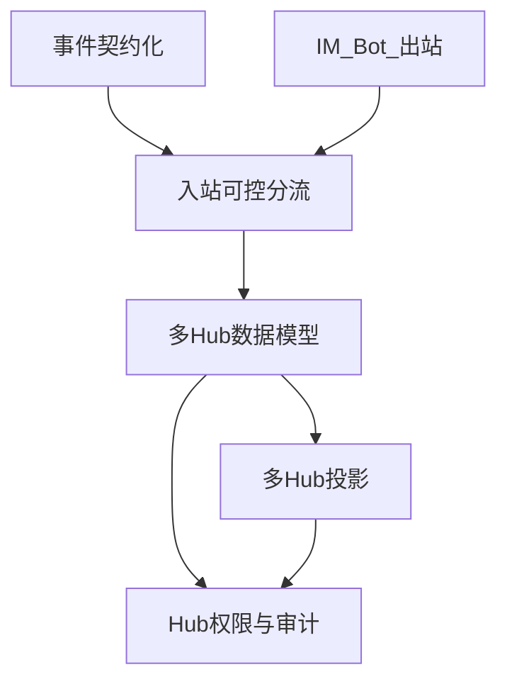

# 阶段 2 设计审阅报告

## 1. 审阅范围

本文审阅 `阶段 3-4 缺口改造` 方案中与方向 D 直接相关的部分，重点聚焦第 9、10、11 项：

- 第 9 项：多 Hub / 多张事项推进表。
- 第 10 项：IM 出站统一改为机器人身份。
- 第 11 项：用户入站消息经 Node 分流后进入 OpenClaw 或业务工作流。

CLI、会前 relatedDocs 补强、邮件、文档评论和周期性汇总仍保留为后续方向，但不作为本轮方向 D 事件中枢的优先深化范围。

本轮目标不是扩大阶段 3-4 的全部范围，而是把方向 D 的“团队重点事项追踪表自动维护器”做成可信事件中枢：事件接入状态可信、Hub 归属明确、权限可控、投影可追溯、机器人触达一致。

## 2. 当前实现校验

当前代码已经具备方向 D 的基础骨架，但还没有达到多团队事件中枢的要求。

### 2.1 已具备的基础

- `src/trigger/dispatcher.ts` 已改为事件处理器注册表，覆盖会议开始、会议结束、卡片回调、IM、文档、Wiki、任务、邮件等事件键。
- `src/agent-tools/routes.ts` 已改为工具注册表，包含事项抽取、source ingestion、风险检查、事项查询、事件中枢可视化等工具。
- `src/application/event-hub-visualization-service.ts` 已能生成“事件中枢”路线表，并暴露 `visualizeEventHub`、`publishEventHubView`、`completeEventHubTask` 等工具。
- `schema.sql` 已有 `work_items`、`task_bindings`、`source_references`、`knowledge_assets`、`knowledge_artifacts`、`push_records` 和 `execution_records`，能支撑单 Hub 的事项中枢雏形。

### 2.2 主要缺口

- 事件中枢目前更像静态路线清单。`event-hub-visualization-service.ts` 将 `doc_update`、`wiki_update`、`task_update`、`mail_received` 等标记为“启用 / 已完成”，但真实事件适配、拉取补偿和 payload 契约并未全部闭环。
- `handleSourceIngestionEvent` 仍依赖浅层字段递归提取，尚未按飞书 `event_type` 建立稳定 adapter。真实 `im.message.receive_v1` 的 `message.content` 通常需要按消息类型解析，而不是直接把 `content` 当纯文本。
- `src/integration/message.ts` 中交互卡片仍显式使用 `--as user`，文本消息也没有显式约束 bot 身份，方向 D 的群通知会出现发送身份不一致。
- 数据模型仍是单 Hub / 单 Base。`work_items` 没有 Hub 维度，`task_bindings` 的 `bitable_record` 也无法区分同一事项在不同 Hub 表中的 record。
- 入站 IM 还没有清晰分流：普通群消息、`/help`、Hub 指令、@机器人自然语言问询、source ingestion 需要不同处理路径。

## 3. 采纳方案

### 3.1 采纳第 9 项：单事项真源 + 多 Hub 投影

采用“单 `work_items` 真源 + 多 Hub 投影”的架构作为方向 D 的优先改造主线。

核心判断：

- `work_items` 保持全局事项真源，字段、状态、负责人、截止时间和归并结果以数据库为准。
- 团队 Hub、个人 Hub、未来组织 Hub 都只是同一事项在不同上下文下的投影视图。
- 飞书 Base 行不是历史真源，只是 Hub 投影的外部表现。
- 同一 `work_item_id` 可以投影到团队 A、团队 B、负责人个人 Hub 等多个位置，但必须由投影表记录其 Hub 归属和外部 record。

推荐数据模型：

- `item_hubs`：记录 Hub 类型、名称、飞书 Base token、table id、默认 chat id、创建者、个人 Hub 归属用户、状态和元数据。
- `hub_members`：记录 Hub 成员、角色、能力位、加入时间和继承顺位。
- `work_item_hub_projections`：记录 `work_item_id + hub_id` 的投影关系、投影角色和外部 Base record。
- `hub_audit_log`：记录 Hub 指令、成员变更、权限失败、投影同步、管理员转让等操作。

`task_bindings` 需要调整，避免 `bitable_record` 在多表场景中混用。首选做法是绑定 `projection_id`；若迁移成本较高，可先绑定 `(work_item_id, hub_id)` 并增加唯一约束。

成员策略采纳以下规则：

- 活跃团队 Hub 必须至少有一名 `owner_admin`。
- 团队 Hub 成员降到 1 人时自动解散，未完结事项迁入该成员个人 Hub。
- 成员被移除且其仍是事项负责人时，进入 owner 转交流程。
- 角色采用能力位模型，避免只用 `admin/member` 无法表达只读、协作、编辑、成员管理等差异。

### 3.2 采纳第 10 项：IM 出站统一 bot 身份

方向 D 的通知、确认、风险提醒、帮助信息和 OpenClaw 回复都应由同一个应用机器人发出。

直接采用：

- 卡片消息默认使用 bot 身份。
- 文本消息默认使用 bot 身份。
- 用户在群里看到的事件中枢反馈、Hub 指令反馈和自然语言回复都来自机器人。

暂不一刀切修改：

- Base 表写入、字段管理、表创建等操作是否使用 bot，要取决于飞书多维表格权限、协作者配置和租户策略。
- 日历、通讯录等可能仍需要 user 授权的 API，不纳入“IM 统一 bot”的范围。

验收标准：

- 会后确认卡片、风险卡片、`/help` 回复和 OpenClaw 问询回复均显示为应用机器人发送。
- 测试群中无需个人 user 态登录也能稳定发送 IM。
- 机器人未进群、scope 不足或发送失败时返回明确错误，不静默失败。

### 3.3 采纳第 11 项：Node 分流 + OpenClaw 工具编排 + bot 回复

采用目标架构：飞书事件先进入 Node，Node 完成验签、幂等、限流、Hub 解析、权限校验、审计和分流；只有对话理解、填槽和工具编排类请求进入 OpenClaw。

首期按可控分流落地：

- `/help`：Node 直接处理，返回当前 Hub、用户角色和可用操作。
- 固定 Hub 指令：Node 做轻量解析，必要时调用业务服务或 agent-tools。
- @机器人自然语言问询：Node 注入 `actorOpenId`、`chatId`、`hubId` 后调用 OpenClaw，由 OpenClaw 决定使用哪个 agent-tool。
- 普通群消息：只在命中关键词、@机器人或显式规则时进入 source ingestion，避免所有群消息都打 Gateway。
- 卡片回调：继续走确定性 workflow，不进入 OpenClaw。

不接受“飞书 payload 直接进 OpenClaw”。理由是 OpenClaw 不应承担飞书验签、幂等、Hub 权限、审计和租户隔离职责。

## 4. 暂缓或不采用项

### 4.1 暂缓 CLI 深入改造

CLI 方向更接近方向 C 的开发者体验。当前方向 D 的核心风险在事件摄入、Hub 归属、投影一致性和机器人触达，不应先扩展 CLI 入口。

保留动作：

- 文档中继续保留 CLI 作为后续入口。
- 不在本轮改造中优先实现 `normalizeCliCommand -> dispatchToWorkflow` 的完整闭环。

### 4.2 暂缓会前 relatedDocs 补强

会前背景卡片属于方向 B 的增强能力。它与方向 D 有关联，但不是事件中枢可信度的前置条件。

暂缓理由：

- 当前第 9/10/11 项会改变 Hub、权限、入站分流和触达身份，优先级更高。
- relatedDocs 检索需要额外处理文档搜索、证据引用和 artifact 追溯，适合在事件中枢稳定后补。

### 4.3 暂缓邮件、文档评论和周期性汇总深入实现

邮件、文档评论、周期性汇总是方向 D 后续价值来源，但本轮先不展开深实现。

本轮只要求：

- 事件中枢表中将这些事件标为 `待接入` 或 `需拉取`，不能再标成已完成。
- adapter 层明确哪些事件能直接解析正文，哪些只返回“需要异步拉取”。
- 后续再补拉取游标、去重和 source ingestion。

### 4.4 不采用“只靠 Base 多表、不建投影真源”

不采用只在 Base 里建多张表、数据库仍保持单表或只加默认 Hub 的方案。

理由：

- 无法可靠回答“某事项是否应该出现在某 Hub 表中”。
- 用户退群、成员移除、个人镜像撤销时，缺少投影真源会导致 Base 行难以清理。
- `task_bindings` 的外部 record 会在多表中混淆。
- 审计无法追溯“谁让这条事项进入或离开某个 Hub”。

### 4.5 不采用“所有入站群消息都打 OpenClaw”

不采用全量群消息进入 OpenClaw。

理由：

- 群消息噪声大，成本和延迟不可控。
- Gateway 故障会影响普通摄入链路。
- 方向 D 的事件中枢需要可解释的规则和审计，不能把所有分流责任都交给 LLM。

## 5. 方向 D 事件中枢改造任务规划

### P0：事件中枢可信化

目标：让事件中枢从“静态路线图”变成可信的接入状态表。

任务：

1. 新增飞书事件 adapter，按 `event_type` 映射到标准 payload。
2. `im.message.receive_v1` 解析 `message_id`、`chat_id`、`sender`、`message_type` 和 `content`，只把可用文本送入 source ingestion。
3. 文档、Wiki、邮件、任务等暂未闭环事件标记为 `待接入` 或 `需拉取`，不要标记为已完成。
4. 事件中枢路线增加字段：接入状态、是否需要异步拉取、是否需要 Hub、是否进入 OpenClaw、失败处理策略。
5. `handleSourceIngestionEvent` 不再依赖浅层猜字段，改为消费 adapter 产出的标准结构。

验收：

- 真实或脱敏的飞书 IM 事件样本能稳定映射为 `originChannel=im`、`originContextId=message_id`、`contentText`。
- 未完成的 doc/wiki/mail/task 事件在 Base 事件中枢中显示为非完成状态。
- 事件缺字段时日志能说明缺失路径和事件类型。

### P0：IM 出站 bot 化

目标：方向 D 所有 IM 触达统一为应用机器人身份。

任务：

1. 修改 `sendInteractiveMessage`，默认使用 `--as bot`。
2. 修改 `sendTextToChat`，显式使用 bot 身份。
3. 梳理 `updateCard` 是否需要 bot 身份或是否只能更新 bot 发送的消息。
4. 写入运行说明：机器人需进群、具备发消息 scope，Base 写入身份另行验证。

验收：

- 会后确认卡片、风险卡片、`/help` 文本都由机器人发送。
- user 未登录或 user token 失效时，IM 发送不受影响。

### P0：入站可控分流

目标：让 IM 入站进入明确路径，而不是混在 source ingestion 中。

任务：

1. 在 IM adapter 后增加 route decision：`help`、`hub_command`、`agent_question`、`source_ingestion`、`ignore`。
2. `/help` 直接返回当前 Hub、用户角色和可用指令。
3. @机器人自然语言问询进入 OpenClaw，调用 agent-tools 后由 bot 回复。
4. 普通群消息只有命中规则时才进入 source ingestion。
5. 卡片回调继续走 `card-callback` workflow。

验收：

- 用户发送 `/help` 获得确定性回复。
- 用户 @机器人问“总结当前阻塞事项”时，经 OpenClaw 查询工具并由 bot 回复。
- 普通闲聊不会触发 OpenClaw。

### P1：多 Hub 数据模型

目标：建立团队 Hub、个人 Hub 与投影真源。

任务：

1. 新增 `item_hubs`。
2. 新增 `hub_members`。
3. 新增 `work_item_hub_projections`。
4. 新增 `hub_audit_log`。
5. 迁移现有单 Base 配置为 `legacy` 或默认团队 Hub。
6. 为现有 `work_items` 插入默认 `primary` 投影。
7. 调整 `task_bindings`，为 `bitable_record` 增加 `projection_id` 或 `hub_id` 维度。

验收：

- 现有单表数据迁移后仍可投影。
- 同一事项能拥有团队 Hub 投影和个人 Hub 镜像投影。
- Base record 能准确反查到 `work_item_id + hub_id`。

### P1：Hub 解析、权限与 agent-tools

目标：所有入站指令和 OpenClaw 工具调用都带 Hub 上下文，并经过权限校验。

任务：

1. 建立 `chat_id -> hub_id` 解析规则，支持一个 chat 绑定多个 Hub 时的歧义提示。
2. 建立短期会话绑定：`chat_id + user_open_id -> hub_id`。
3. 增加 `assertHubPermission(actorOpenId, hubId, action)`。
4. agent-tools schema 增加 `hubId`、`actorOpenId`，用于 Hub 查询、增删改、成员管理和投影同步。
5. 权限失败返回结构化错误，由 bot 明确回复。

验收：

- 同一用户在团队 A 和 B 中可以只操作当前 Hub。
- chat 绑定多个 Hub 时，机器人要求用户选择。
- 非授权用户执行管理指令时不写库，并返回明确原因。

### P1：多 Hub 投影

目标：Base 投影从单表升级为按 Hub 投影。

任务：

1. 封装 `resolveHubTable(hubId)`。
2. 将 `projectWorkItemsToBase` 改为按 Hub upsert。
3. `findRecordIdByWorkItemId` 改为 per-hub 查询。
4. 个人 Hub 镜像规则首期采用：用户是 owner 或 participant 时投影到其个人 Hub。
5. 团队 Hub primary 投影来自会议群、IM 群、显式 hub 指令或默认 Hub。

验收：

- 团队 A、B 的 Base 表默认互不包含对方专属事项。
- 用户个人 Hub 可聚合其作为 owner/participant 的事项。
- 同一事项字段更新后，各相关 Hub 投影最终一致。

### P2：成员生命周期与审计

目标：成员变更不会留下无主 Hub、孤儿事项或不可追溯投影。

任务：

1. 实现邀请、移除、角色调整、管理员转让工具。
2. 移除成员时触发负责人转交。
3. `owner_admin` 离开或降权前必须产生继任者。
4. 团队 Hub 剩 1 人时自动解散，并将未完结事项迁入其个人 Hub。
5. 所有 Hub 指令、成员变更、权限失败、投影同步写入 `hub_audit_log`。

验收：

- 活跃团队 Hub 始终至少有一名 `owner_admin`。
- 团队 Hub 最后一人规则执行后，未完结事项出现在该成员个人 Hub。
- 审计日志能回答“谁在什么时候通过什么入口改了哪个 Hub 的哪条事项”。

## 6. 优先级结论

本轮应采用的核心主线是：

最终判断：

- 第 9 项应直接纳入优先改造，不再只作为远期架构。
- 第 10 项应直接采用，但范围限定为 IM 出站，Base/OpenAPI 其他写操作按权限另行验证。
- 第 11 项应采用 Node 中转与 OpenClaw 工具编排目标，但首期必须可控分流，不能全量群消息进 OpenClaw。
- CLI、会前补强、邮件/文档评论深接入、周期性汇总暂缓到事件中枢和多 Hub 投影稳定之后。
