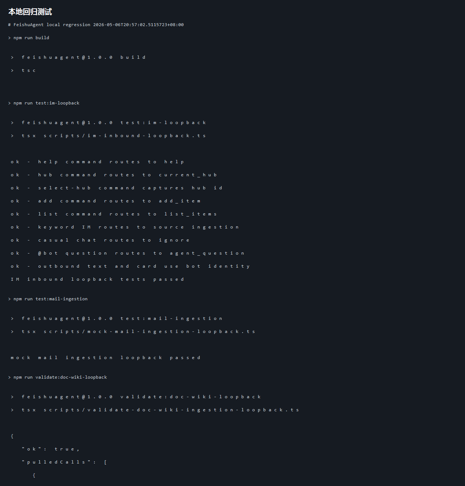
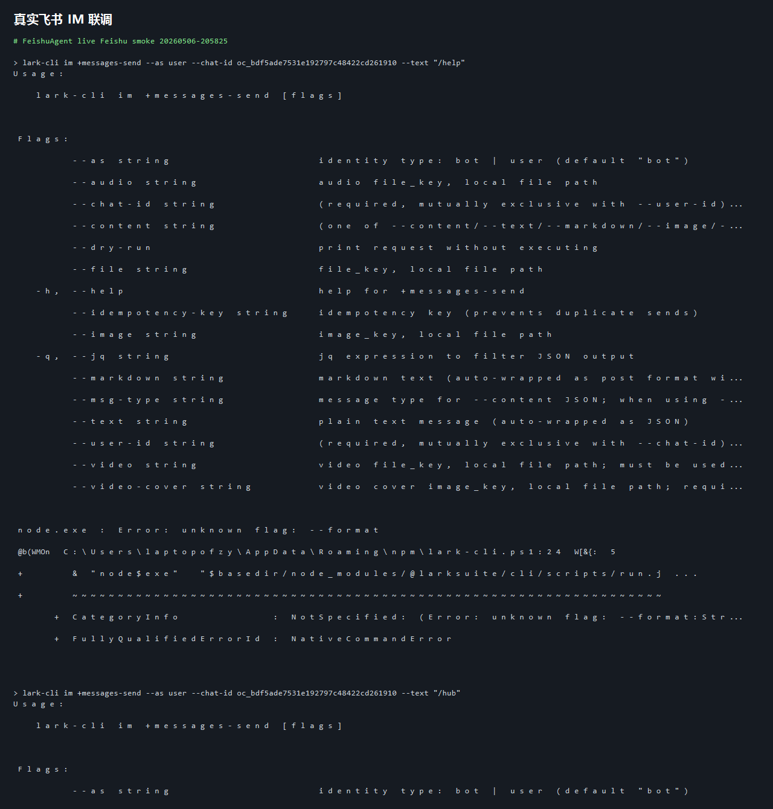
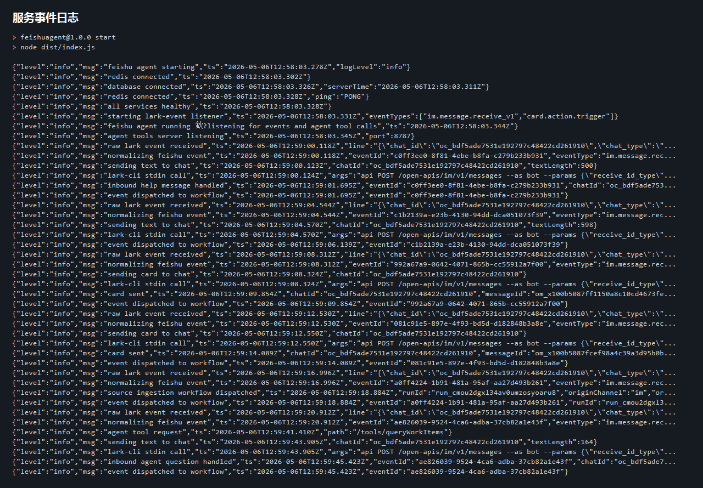
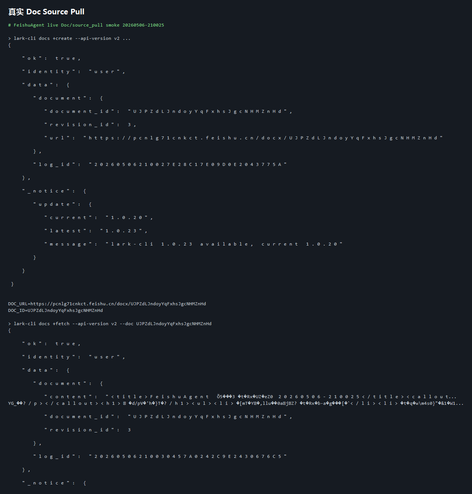
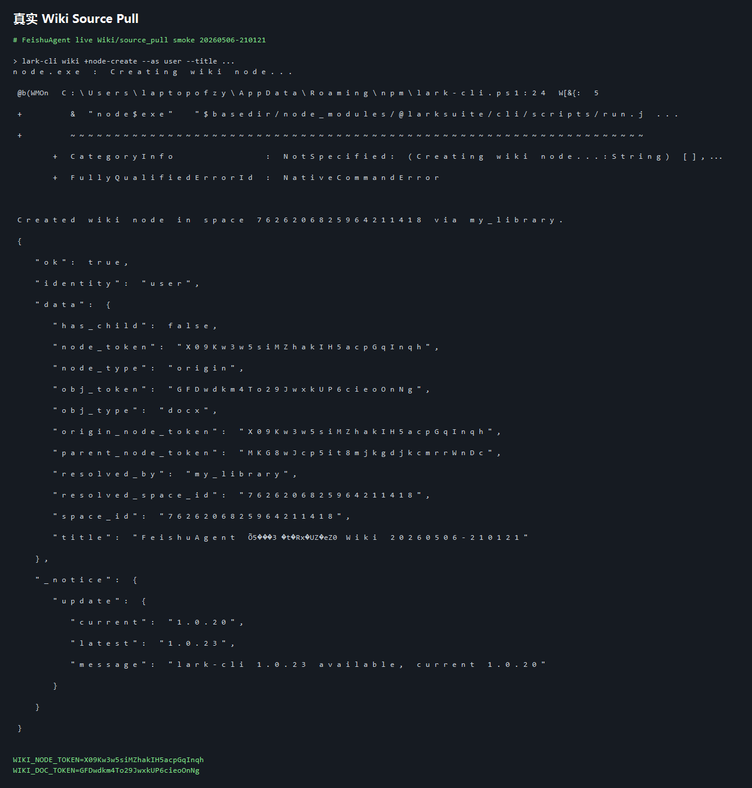
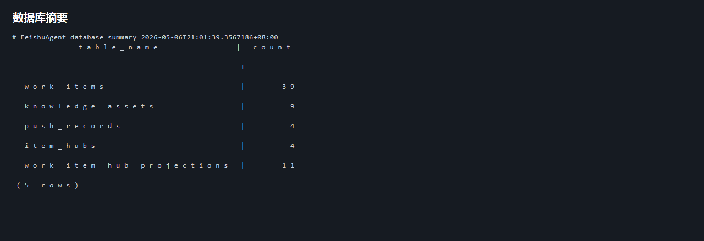

# FeishuAgent 项目展示评审文档

## 1. 项目概述

FeishuAgent 是一个面向飞书办公场景的主动知识服务 Agent。它不是简单聊天 Bot，而是围绕团队协作中最容易丢失的待办、风险、负责人、截止时间和来源证据，构建一个可追踪、可分派、可验证的团队事项中枢。

项目选择 `FeishuProject.md` 中的方向 D「团队待办中枢与进展自动对账」作为主线，同时把方向 B「会议与项目全链路伴侣」作为高频入口。系统通过 OpenClaw、lark-cli、飞书 IM / Doc / Wiki / Task / Base 等能力，把分散在消息、文档、知识库、会议纪要和任务里的信息转化为结构化 WorkItem，并通过机器人、卡片、Base 推进表和后台工作流完成闭环。

核心价值：

- 从「人主动搜索信息」变成「系统主动识别事项并推送给人」。
- 从「群聊里口头约定」变成「有状态、有负责人、有来源证据的 WorkItem」。
- 从「一次性摘要」变成「可持续对账、可审计、可评测的事项中枢」。

## 2. Demo 展示

### 2.1 本地回归测试

本地回归覆盖构建、IM 分流、邮件摄入、Doc/Wiki source pull、任务状态回流、卡片回调数据库闭环。

对应原始终端输出保存在：

- `docs/final/demo/local-regression.txt`

### 2.2 真实飞书 IM 联调

使用已授权 user 身份向机器人所在聊天发送测试消息，验证机器人事件消费、指令分流、卡片回复、关键词事项摄入和 OpenClaw 问询路径。

已验证消息类型：

- `/help`：机器人返回帮助文本。
- `/hub`：机器人返回当前 Hub 信息。
- `/add FeishuAgent 阶段3评审演示待办 ...`：机器人返回 WorkItem 草稿卡片。
- `/list`：机器人返回当前 Hub WorkItem 卡片。
- 普通关键词消息：触发 `source-ingestion`。
- `/ask 总结当前阻塞事项`：进入 OpenClaw / agent-tools 路径并由机器人回复。

服务事件日志显示真实 `im.message.receive_v1` 事件被接收、归一化、分发，并由 bot 身份发送文本或卡片。

对应原始终端输出保存在：

- `docs/final/demo/live-feishu-smoke.txt`
- `docs/final/demo/live-service-log.txt`

### 2.3 真实 Doc / Wiki 拉取验证

Demo 中创建并更新了真实飞书 Doc 与 Wiki 页面，然后通过项目内 `source_pull` 路径读取正文，验证文档类知识源可以进入统一摄入流程。

真实 Doc：

- `https://pcnlg71cnkct.feishu.cn/docx/UJPZdLJndoyYqFxhsJgcNHMZnHd`

真实 Wiki：

- Wiki node token：`X09Kw3w5siMZhakIH5acpGqInqh`
- 关联 Docx token：`GFDwdkm4To29JwxkUP6cieoOnNg`

对应原始终端输出保存在：

- `docs/final/demo/live-doc-source-pull.txt`
- `docs/final/demo/live-wiki-source-pull.txt`

### 2.4 数据库状态摘要

系统已具备 WorkItem、KnowledgeAsset、PushRecord、Hub、Hub 投影等核心数据结构，并能在本地回归和真实联调中保持可查询状态。

对应原始终端输出保存在：

- `docs/final/demo/database-summary.txt`

## 3. 完整性与价值

### 3.1 解决的问题

团队协作中，真正需要执行的信息通常分散在飞书群聊、会议纪要、文档、知识库和任务系统中。传统搜索或问答只能回答「哪里有信息」，但不能保证信息被分派、跟进、确认和复盘。

FeishuAgent 解决的是更靠近执行的问题：

- 哪些内容应该沉淀为待办、风险或决策？
- 这些事项属于哪个团队 Hub？
- 谁负责？什么时候完成？来源证据是什么？
- 事项是否需要人工确认？是否已经同步到推进表？

### 3.2 AI 的关键作用

AI 在系统中不是简单做摘要，而是承担三类关键职责：

- 结构化抽取：把会议纪要、群消息、文档正文中的自然语言转成 WorkItem。
- 语义归并：识别跨来源重复事项，避免同一事项被重复创建。
- 上下文判定：结合来源、群聊、文档、负责人、历史事项，判断事项应该进入哪个 Hub，并在低置信时交给人工确认。

### 3.3 流程闭环

当前 Demo 已覆盖从真实飞书输入到机器人反馈的主链路：

1. 用户在飞书聊天中发送指令或事项消息。
2. 本地事件监听收到 `im.message.receive_v1`。
3. `dispatcher` 将事件分流为帮助、Hub 指令、OpenClaw 问询或 source ingestion。
4. 机器人以 bot 身份回复文本或交互卡片。
5. 文档 / Wiki 内容可通过 source pull 拉取为统一 payload。
6. 卡片回调本地数据库闭环已覆盖确认、驳回、修改、风险认领等动作。

这个流程具备演示稳定性，也具备落地扩展空间。

### 3.4 实际价值

项目带来的价值主要体现在：

- 降低会后整理和群聊追踪成本。
- 减少待办漏记、负责人不清、截止时间不明确的问题。
- 保留来源证据，方便复盘和追责。
- 通过 Hub 投影支持团队视图和个人视图，避免 Base 表成为唯一事实源。
- 通过测试脚本和事件日志增强 Demo 的可验证性。

## 4. 创新性

### 4.1 从聊天 Bot 到事项中枢

项目没有停留在「问一句答一句」的聊天 Bot 形态，而是把 AI 输出沉淀为可持续管理的 WorkItem。WorkItem 是系统的执行真源，机器人、卡片、Base 表和报告都是它的不同触达和投影方式。

### 4.2 OpenClaw + 确定性业务内核

系统采用「OpenClaw Agent 主体 + Node.js 确定性业务内核」的分工：

- OpenClaw 负责理解意图、选择工具、组织自然语言反馈。
- Node.js 服务负责数据库、幂等、状态机、审计、Hub 投影和飞书写回。

这让 AI 有足够参与度，同时避免高风险业务动作完全由模型自由执行。

### 4.3 多 Hub 归属与 Guardrails

项目引入 Hub 作为事项协作上下文，区分来源 Hub、责任 Hub、个人镜像和协作 Hub。对于私聊、跨团队文档、评论 @、转发等复杂场景，系统通过 guardrails 保证：

- 私聊内容不默认进入团队 Hub。
- 显式绑定优先于 AI 推断。
- 评论 @ 影响负责人和触达，不自动扩散可见性。
- 高影响或低置信操作进入人工确认。

这种设计兼顾了智能、隐私和组织边界。

### 4.4 可复用的事件中枢模式

事件接入、source pull、source ingestion、Hub assignment 和 projection 的结构可以复用于更多办公系统。后续接入邮件、任务、日历或其他知识源时，只需要新增 adapter 和映射，不需要重写主流程。

## 5. 技术实现性

### 5.1 架构合理性

核心架构分为：

- `trigger`：飞书事件监听、标准化和分发。
- `workflow`：后台工作流，如 source ingestion、会前/会后、风险巡检。
- `application`：应用服务，承接可复用业务流程。
- `domain`：WorkItem、Hub assignment、LLM 结构化输出等领域逻辑。
- `integration`：lark-cli、飞书消息、任务、Base、Doc/Wiki/Mail 适配。
- `touchpoint`：卡片渲染与用户触达。
- `evaluation`：执行记录、push 记录和评测脚本。

### 5.2 核心代码展示

事件分发与多源接入：

- `src/trigger/dispatcher.ts`
- `src/trigger/feishu-ingestion-adapter.ts`
- `src/trigger/event-config.ts`

Source ingestion 与多源正文拉取：

- `src/workflow/source-ingestion.ts`
- `src/application/source-ingestion-service.ts`
- `src/application/feishu-source-pull-service.ts`
- `src/application/mail-ingestion-service.ts`
- `src/application/task-reconciliation-service.ts`

AI 与 Hub 归属判定：

- `src/application/hub-assignment-service.ts`
- `src/domain/hub-assignment.ts`
- `src/domain/openclaw-client.ts`
- `src/openclaw/system-prompt.md`

卡片与触达闭环：

- `src/application/card-callback-service.ts`
- `src/touchpoint/render.ts`
- `src/integration/message.ts`
- `src/evaluation/push-records.ts`

本地回归与 Demo 验证：

- `scripts/im-inbound-loopback.ts`
- `scripts/validate-doc-wiki-ingestion-loopback.ts`
- `scripts/validate-real-source-pull.ts`
- `scripts/mock-task-update-loop.ts`
- `scripts/card-callback-loop-test.ts`

### 5.3 工程稳定性

项目已具备多层验证：

- TypeScript 编译检查。
- IM 入站纯函数回归。
- Mail mock ingestion 回归。
- Doc/Wiki source pull 回归。
- Task 状态映射 mock 回归。
- Card callback 数据库闭环回归。
- 真实飞书 IM、Doc、Wiki 联调记录。

这种验证组合能支撑 Demo 稳定演示，也方便后续扩展新来源。

## 6. AI 亮点介绍

### 6.1 高阶 AI 技巧

项目使用的 AI 技巧包括：

- 结构化输出：要求 LLM 输出可校验 JSON，再由 Zod schema 校验。
- 证据包压缩：不是把完整聊天记录或整篇文档直接交给模型，而是先提取来源、人员、候选 Hub、相关片段和历史事项。
- Agent 决策 + 规则护栏：AI 给出 HubAssignmentDecision，确定性 guardrails 再做安全校验。
- 工具调用：OpenClaw 通过 `agent-tools` 查询事项、同步 Hub、巡检风险，而不是凭空回答。

### 6.2 人和 AI 的分工

AI 负责理解和生成：

- 从自然语言中抽取待办、风险、决策。
- 结合上下文判断事项归属。
- 生成面向用户的解释和摘要。

系统负责确定性执行：

- 幂等、数据库写入、状态迁移。
- 飞书任务、Base、卡片和消息写回。
- 权限边界、审计日志和人工确认。

人负责最终确认：

- 低置信事项是否采纳。
- 负责人和截止时间是否正确。
- 跨 Hub 可见性是否允许。

### 6.3 模型选型思路

项目把 OpenClaw 作为 Agent 主体，而不是只把模型当作 HTTP 补全文本接口。这样可以让模型参与场景选择和工具编排，同时把业务状态和副作用保留在项目服务内。

### 6.4 对原有工作流的改变

引入 AI 后，团队协作流程从「人工翻聊天记录、整理待办、维护表格」变为：

1. 系统监听飞书事件。
2. AI 提炼高密度事项。
3. 事项进入统一中枢。
4. 机器人和卡片主动触达用户。
5. 用户确认后形成可追踪闭环。

这使知识流转从被动搜索变成主动服务，从一次性文本变成可管理状态。

## 7. 评审展示建议

建议 Demo 展示顺序：

1. 先展示本地回归截图，证明 Demo 可复现。
2. 展示飞书群中发送 `/help`、`/hub`、`/add`、`/ask` 后机器人响应。
3. 展示服务日志中真实事件被接收、分发、回复。
4. 展示 Doc/Wiki 创建与 source pull 验证。
5. 展示核心代码结构，说明事件、AI、Hub、卡片闭环如何协作。
6. 最后讲项目亮点：从聊天 Bot 升级为团队事项中枢，OpenClaw 负责智能决策，Node.js 保证确定性执行。
