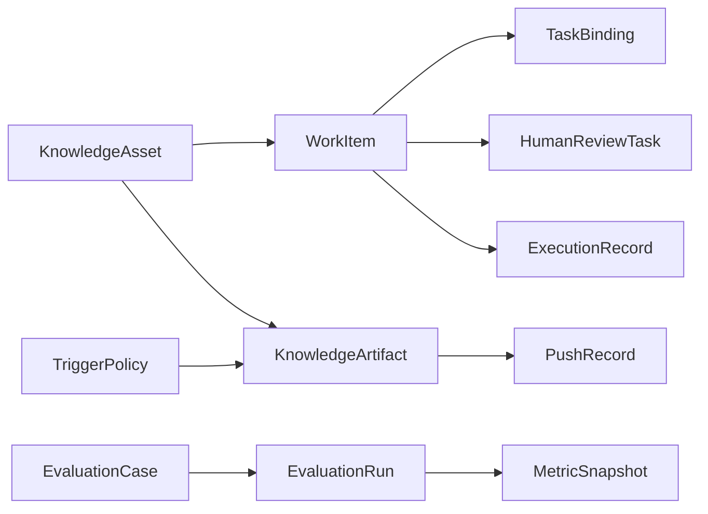
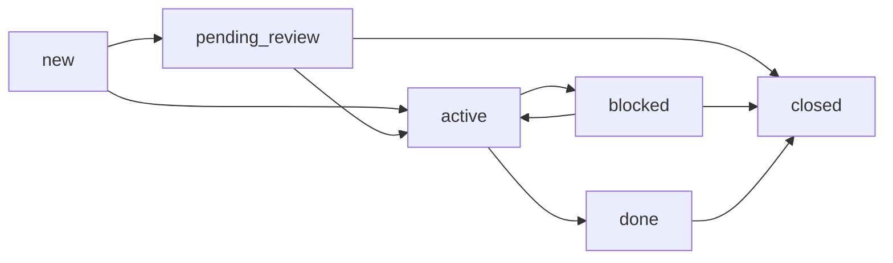

# 办公场景驱动的智能知识助手对象模型与模块设计说明

## 1. 文档目的
本文档用于在《架构设计说明书》基础上，进一步细化对象模型、数据库逻辑设计、工作流编排边界和模块拆分方案。

本文档重点回答四个问题：
- 系统的核心对象到底有哪些
- 这些对象之间如何关联
- 数据库逻辑上应如何组织
- Trigger.dev 工作流与模块应如何围绕 D 主线展开

## 2. 设计修正结论

### 2.1 主方向不变
- 核心主线仍然是 `D`：团队待办中枢与进展自动对账。
- `B` 仍然是首个高频入口场景，但不再作为整个对象模型和工作流的中心。
- `A` 是管理洞察输出面。
- `C` 是 CLI 场景输出面。

### 2.2 模型中心修正
系统不再仅由 `WorkItem` 单核心承载，而是采用：

- **`WorkItem`**：负责执行闭环、状态追踪、任务映射
- **`KnowledgeArtifact`**：负责高密度知识产物、主动输出与内容表达

这两个对象共同构成系统的双核心。

### 2.3 新增正式对象
为了与赛题“主动推送”和“效果验证”要求对齐，正式引入：
- `TriggerPolicy`
- `EvaluationCase`
- `EvaluationRun`
- `MetricSnapshot`

同时把赛题原文中的 **邮件** 纳入知识来源建模范围。

## 3. 总体对象模型



系统对象分为四组：
- 执行闭环对象
- 知识对象
- 触发与交互对象
- 过程与评测对象

## 4. 核心对象一：WorkItem

## 4.1 定义
`WorkItem` 是系统统一事项对象，用于承载团队需要持续推进、分派、预警和对账的事项。

它不是原始数据，也不是简单待办，而是经过抽取、归并和结构化后的“可执行事项单元”。

## 4.2 适用范围
`WorkItem` 应承载：
- Todo
- Decision
- Risk
- Blocker

它不直接承载：
- 会前背景卡片
- 周报摘要
- CLI 知识提示

这些属于 `KnowledgeArtifact` 的范围。

## 4.3 核心属性建议

### 基础字段
- `id`
- `title`
- `itemType`
  - `todo` / `decision` / `risk` / `blocker`
- `status`
  - `new` / `pending_review` / `active` / `blocked` / `done` / `closed`
- `priority`
  - `low` / `medium` / `high` / `critical`
- `ownerUserId`
- `ownerSource`
  - 手工指定 / 推断 / 来源继承
- `dueAt`
- `confidenceScore`
- `needHumanConfirm`
- `createdAt`
- `updatedAt`

### 关联字段
- `originChannel`
  - `meeting` / `doc` / `wiki` / `im` / `task` / `mail`
- `originContextId`
  - 如 meeting id、doc token、thread id
- `currentTaskBindingId`
- `currentReviewTaskId`
- `currentStateVersion`

### 生命周期字段
- `firstDetectedAt`
- `lastDetectedAt`
- `lastSyncedAt`
- `lastTouchedByWorkflow`

## 4.4 子类型扩展
采用 **主表 `metadata JSONB` 字段** 承载不同 itemType 的差异字段，不使用独立子表。

各 itemType 的 `metadata` 推荐结构：

### `todo` 类型
```json
{ "expectedAction": "", "assigneeCandidateList": [], "estimatedEffort": "", "dependencySummary": "" }
```

### `decision` 类型
```json
{ "decisionSummary": "", "decisionReason": "", "impactArea": "", "effectiveFrom": "" }
```

### `risk` 类型
```json
{ "riskLevel": "", "riskCategory": "", "riskImpact": "", "riskProbability": "", "mitigationSuggestion": "" }
```

### `blocker` 类型
```json
{ "blockerReason": "", "blockedBy": "", "blockedSince": "", "unblockSuggestion": "" }
```

优势：减少 4 张子表和对应的 JOIN 查询，PostgreSQL JSONB 索引可满足按字段过滤需求。

## 4.5 状态机建议



### 状态说明
- `new`：刚被识别，尚未进入稳定管理态
- `pending_review`：高风险或低置信度，等待人工确认
- `active`：已确认并进入推进
- `blocked`：存在阻塞，需要被巡检与提醒
- `done`：事项已完成
- `closed`：事项终止、无效或已合并

## 4.6 数据库主表设计建议

### 表：`work_items`
`WorkItem` 主表建议采用“当前态主表”设计，以支持高频列表查询、总表展示、负责人视图和状态巡检。

#### 建议字段
- `id`
- `title`
- `itemType`
  - `todo` / `decision` / `risk` / `blocker`
- `status`
  - `new` / `pending_review` / `active` / `blocked` / `done` / `closed`
- `priority`
  - `low` / `medium` / `high` / `critical`
- `ownerUserId`
- `ownerSource`
  - `manual` / `inferred` / `inherited`
- `dueAt`
- `confidenceScore`
- `needHumanConfirm`
- `originChannel`
  - `meeting` / `minutes` / `doc` / `wiki` / `im` / `task` / `mail`
- `originContextId`
  - 如 `meeting_id`、`doc_token`、`thread_id`、`mail_thread_id`
- `currentPrimaryBindingId`
- `currentReviewTaskId`
- `dedupeKey`
- `metadata`
  - `JSONB`，承载子类型差异字段（见 §4.4）
- `firstDetectedAt`
- `lastDetectedAt`
- `lastSyncedAt`
- `lastTouchedByWorkflow`
- `createdAt`
- `updatedAt`
- `deletedAt`

#### 设计说明
- `ownerUserId` 保留在主表，是因为后续按负责人筛选、巡检和提醒都是高频查询。
- `dedupeKey` 用于跨会议、跨文档、跨消息的事项归并，第一版建议保留但不强唯一。
- `originChannel + originContextId` 仅记录事项**首次被识别**的上下文（如首次从哪场会议中被抽取），用于快速回溯和初始去重。它不随事项的后续更新而改变。
- `source_references` 表记录事项**所有**相关知识资产引用，随着事项被多次检测、归并和更新而持续增长。两者职责不同，不互相替代。

## 4.7 子类型扩展说明（已简化）

子类型差异字段已统一收入 `work_items.metadata` JSONB 字段（见 §4.4），不再使用独立子表。

设计原则：
- 每条事项的 `metadata` 结构由 `itemType` 决定。
- 应用层通过 TypeScript 接口约束各类型的 metadata 结构。
- 需要按子类型字段过滤时，使用 PostgreSQL JSONB 操作符或 GIN 索引。

## 4.8 人员关系、绑定关系与审计

### 表：`work_item_participants`
用于承载“单负责人 + 可选关注人/协同人”模型。

#### 建议字段
- `id`
- `workItemId`
- `userId`
- `role`
  - `owner` / `follower` / `collaborator` / `watcher`
- `source`
  - `manual` / `inferred` / `imported`
- `createdAt`

### 表：`task_bindings`
用于承载“一个主绑定 + 多个次级绑定”的设计。

#### 建议字段
- `id`
- `workItemId`
- `bindingType`
  - `feishu_task` / `bitable_record`
- `externalId`
- `isPrimary`
- `bindingRole`
  - `execution` / `tracking` / `projection`
- `syncStatus`
  - `pending` / `synced` / `conflict` / `failed`
- `lastSyncAt`
- `lastSyncError`
- `createdAt`
- `updatedAt`

#### 约束建议
- 同一个 `workItemId + bindingType` 下，只允许一个 `isPrimary = true`。
- 允许多个次级绑定，满足事项同时绑定飞书任务和总表投影的需求。

### 表：`work_item_audit_log`
统一记录状态迁移与字段级变更，合并原 `work_item_state_history` 和 `work_item_change_logs`。

#### 建议字段
- `id`
- `workItemId`
- `changeType`
  - `status_change` / `field_update` / `create` / `merge` / `close`
- `fieldName`
  - 状态迁移时为 `status`，字段变更时为具体字段名
- `fromValue`
- `toValue`
- `reason`
- `changedByType`
  - `workflow` / `human` / `sync` / `policy`
- `changedById`
- `executionRecordId`
- `createdAt`

## 4.9 索引建议
- `status`
- `ownerUserId, status`
- `itemType, status`
- `dueAt`
- `needHumanConfirm, status`
- `originChannel, originContextId`
- `dedupeKey`
- `task_bindings(workItemId, bindingType, isPrimary)` 的唯一约束或唯一部分索引

## 4.10 WorkItem 数据库设计结论
第一版推荐表如下：
- `work_items`（含 `metadata JSONB` 承载子类型差异字段）
- `work_item_participants`
- `task_bindings`
- `source_references`
- `work_item_audit_log`

## 5. 核心对象二：KnowledgeArtifact

## 5.1 定义
`KnowledgeArtifact` 表示系统生成的高密度知识产物，是赛题“主动服务用户”的核心承载对象。

它体现的是：
- 在恰当时机
- 以恰当形态
- 向恰当对象
- 输出经过提纯的知识

## 5.2 为什么它不能被 WorkItem 取代
以下产物不是事项，但都必须被系统统一建模：
- 会前背景知识卡片
- 会后结构化摘要
- 风险洞察报告
- 周报卡片
- CLI 即时避坑提示
- 事项摘要或任务 Digest

因此必须有独立的 `KnowledgeArtifact`。

## 5.3 核心属性建议

### 基础字段
- `id`
- `artifactType`
  - `pre_meeting_brief`
  - `meeting_summary`
  - `risk_report`
  - `weekly_insight`
  - `cli_hint`
  - `task_digest`
- `title`
- `summary`
- `contentPayload`
  - 结构化内容或渲染前 JSON
- `renderFormat`
  - `card` / `doc` / `table` / `cli_text`
- `audienceType`
  - `user` / `group` / `department` / `cli_local`
- `generatedAt`
- `expiresAt`

### 关联字段
- `triggerPolicyId`

来源资产和关联事项通过 `source_references` 表查询（`target_type = 'knowledge_artifact'`），分发记录通过 `push_records.artifactId` 反向查询。不再在 KnowledgeArtifact 上冗余存储数组字段。

### 质量字段
- `confidenceScore`
- `traceabilityLevel`
- `isEvaluated`

## 5.4 生命周期建议
- `draft`
- `ready`
- `published`
- `acknowledged`
- `expired`
- `archived`

## 5.5 数据库设计定位
`KnowledgeArtifact` 采用 **偏产物快照** 的设计，不做“版本数组”模型。

设计原则如下：
- `KnowledgeArtifact` 负责保存逻辑产物本身。
- `PushRecord` 负责保存“给谁、通过什么渠道、何时发送、发送成什么样”的历史。
- 如需多次渲染版本，应把 `renderedPayload` 或渲染版本号放在 `PushRecord` 层，而不是让 `KnowledgeArtifact` 膨胀。

## 5.6 主表设计建议

### 表：`knowledge_artifacts`

#### 建议字段
- `id`
- `artifactType`
  - `pre_meeting_brief`
  - `meeting_summary`
  - `risk_report`
  - `weekly_insight`
  - `cli_hint`
  - `task_digest`
- `title`
- `summary`
- `contentPayload`
  - 逻辑产物正文，建议使用 `JSONB`
- `canonicalRenderFormat`
  - `card` / `doc` / `table` / `cli_text`
- `templateVersion`
- `audienceType`
  - `user` / `group` / `department` / `cli_local`
- `confidenceScore`
- `traceabilityLevel`
- `generatedAt`
- `expiresAt`
- `status`
  - `draft` / `ready` / `published` / `expired` / `archived`
- `isEvaluated`
- `createdByWorkflow`
- `createdAt`
- `updatedAt`

#### 设计说明
- `contentPayload` 存逻辑产物，不直接存多次分发后的具体渲染数组。
- `canonicalRenderFormat` 只表达默认或首选渲染方式。
- `templateVersion` 用于后续回放“当时按什么模板生成”。

## 5.7 关联关系说明

KnowledgeArtifact 与 WorkItem、KnowledgeAsset 之间的关联关系统一由 `source_references` 表承载（详见 §7.2）。

不再设置独立的 `artifact_work_item_refs` 和 `artifact_asset_refs` 表，避免引用关系三处定义重叠。

通过 `source_references.target_type = 'knowledge_artifact'` 即可查询某个知识产物的所有来源资产引用和关联事项。

## 5.8 分发记录设计建议

### 表：`push_records`
一条分发一行，负责记录多次分发和多渠道渲染。

#### 建议字段
- `id`
- `artifactId`
- `channelType`
  - `card` / `im` / `doc` / `base` / `cli`
- `targetType`
  - `user` / `group` / `department` / `cli_local`
- `targetId`
- `renderVersion`
- `renderedPayload`
  - 保存该次分发的最终渲染结果，必要时可为空
- `externalMessageId`
- `deliveryStatus`
  - `pending` / `sent` / `failed` / `acknowledged`
- `clicked`
- `acknowledgedAt`
- `sentAt`
- `createdAt`

#### 设计说明
- `KnowledgeArtifact` 不承载多次分发版本历史。
- 多次分发完整追溯由 `push_records` 负责。
- 不同渠道渲染差异通过 `renderVersion` 与 `renderedPayload` 体现。

## 6. 核心对象三：TriggerPolicy

## 6.1 定义
`TriggerPolicy` 表示系统主动触发与主动分发策略。

它回答的问题是：
- 什么时候触发
- 由谁触发
- 对谁触达
- 用什么形式触达
- 触发后生成什么产物

## 6.2 为什么要独立建模
如果没有 `TriggerPolicy`，触发逻辑会散落在：
- 工作流定义
- 提示词逻辑
- if/else 规则
- 配置文件

后续很难进行：
- 策略复用
- 策略调优
- A/B 实验
- 触达效果评估

## 6.3 核心属性建议
`TriggerPolicy` 采用 **结构化字段 + 扩展表达式混合** 的设计。

设计原则如下：
- 常用、高频、可索引的触发条件采用结构化字段。
- 复杂组合逻辑、阈值逻辑、条件表达式通过扩展表达式字段承载。
- 执行器优先读取结构化字段，只有需要复杂判断时才解释扩展表达式。

### 触发条件（结构化字段）
- `id`
- `policyName`
- `policyScope`
  - `B` / `D` / `A` / `C`
- `triggerType`
  - `scheduled` / `event` / `threshold` / `manual`
- `triggerSource`
  - `meeting_end` / `meeting_start` / `doc_edit` / `task_change` / `mail_sync` / `cli`
- `cooldownWindow`

### 产物与触达
- `artifactType`
- `deliveryChannel`
  - `card` / `im` / `doc` / `base` / `cli`
- `targetSelector`
  - 责任人 / 会议参与人 / 部门群 / 当前终端用户
- `reviewRequirement`
  - `none` / `high_risk_only` / `always`

### 评估字段
- `enabled`
- `lastTriggeredAt`
- `successCount`
- `failureCount`
- `acceptanceRate`

## 6.4 数据库主表建议

### 表：`trigger_policies`

#### 建议字段
- `id`
- `policyName`
- `policyScope`
- `triggerType`
- `triggerSource`
- `cooldownWindow`
- `artifactType`
- `deliveryChannel`
- `targetSelector`
- `reviewRequirement`
- `enabled`
- `lastTriggeredAt`
- `successCount`
- `failureCount`
- `acceptanceRate`
- `createdAt`
- `updatedAt`

#### 设计说明
- 结构化字段支撑高频查询、过滤和配置化管理。
- 第一版采用代码配置驱动策略（TypeScript 枚举 + 条件函数），不引入运行时 DSL 引擎。
- 原 `conditionExpression`、`expressionVersion`、`inputSchemaHint` 三个字段已移除，列入未来演进。

## 7. 支撑对象

## 7.1 `KnowledgeAsset`
表示原始知识资产。

建议来源类型：
- `doc`
- `docx`
- `wiki`
- `minutes`
- `meeting_notes`
- `im_message`
- `task_snapshot`
- `mail`

建议字段：
- `id`
- `assetType`
- `sourceId`
- `title`
- `contentText`
- `contentChunkRef`
- `vectorRef`
- `ownerUserId`
- `createdAt`
- `updatedAt`

## 7.2 `SourceReference`（统一来源引用表）
系统中所有"来源引用"关系统一由 `source_references` 一张表承载。它既替代原 `artifact_work_item_refs` 和 `artifact_asset_refs`，也覆盖 WorkItem 与知识资产之间的引用。

建议字段：
- `id`
- `targetType`
  - `work_item` / `knowledge_artifact`
- `targetId`
- `assetId`
  - 指向 `knowledge_assets`，当引用的是 WorkItem 而非资产时可为空
- `relatedWorkItemId`
  - 当 target 为 knowledge_artifact 且需要关联事项时使用
- `relationType`
  - `derived_from` / `evidence_for` / `related_to` / `primary_basis` / `included_item` / `risk_source` / `source` / `context`
- `excerpt`
- `confidenceScore`
- `createdAt`

## 7.3 `TaskBinding`
表示事项与飞书任务 / 多维表格记录之间的绑定关系。

建议字段：
- `id`
- `workItemId`
- `bindingType`
  - `feishu_task` / `bitable_record`
- `externalId`
- `isPrimary`
- `bindingRole`
  - `execution` / `tracking` / `projection`
- `syncStatus`
- `lastSyncAt`
- `lastSyncError`
- `createdAt`
- `updatedAt`

## 7.4 `HumanReviewTask`
表示高风险或低置信度结果需要人工确认的等待办。

建议字段：
- `id`
- `targetType`
  - `work_item` / `knowledge_artifact`
- `targetId`
- `reviewReason`
- `reviewStatus`
  - `pending` / `approved` / `rejected` / `revised`
- `assignedReviewer`
- `reviewedAt`

## 7.5 `ExecutionRecord`
表示工作流执行过程记录。

建议字段：
- `id`
- `workflowName`
- `triggerType`
- `triggerContextId`
- `status`
- `startedAt`
- `finishedAt`
- `errorCode`
- `errorMessage`

## 7.6 `PushRecord`
表示产物的触达记录。

建议字段：
- `id`
- `artifactId`
- `channelType`
- `targetType`
- `targetId`
- `renderVersion`
- `renderedPayload`
- `messageId`
- `deliveryStatus`
- `clicked`
- `acknowledgedAt`
- `sentAt`
- `createdAt`

## 7.7 评测对象

### `EvaluationCase`
- 定义测试问题、标准答案、场景类型、引用标准

### `EvaluationRun`
- 记录某次评测执行结果、模型输出、评分和误差

### `MetricSnapshot`
- 记录某时间窗口的：
  - 卡片点击率
  - 任务完成率
  - 事项漏记率
  - 会后处理耗时
  - 人工确认比例

## 8. 数据库逻辑设计方向

## 8.1 逻辑分区

### 事项中心
- `work_items`（含 `metadata JSONB` 承载子类型差异字段）
- `work_item_participants`
- `task_bindings`
- `work_item_audit_log`

### 知识中心
- `knowledge_assets`
- `knowledge_artifacts`
- `source_references`

### 触发与交互中心
- `trigger_policies`
- `human_review_tasks`
- `push_records`

### 过程与评测中心
- `execution_records`
- `evaluation_records`（合并原 `evaluation_cases`、`evaluation_runs`、`metric_snapshots`）

## 8.2 检索设计
- 主存仍然是 PostgreSQL
- 向量能力由 `pgvector` 提供
- 建议优先对以下内容建立向量索引：
  - `knowledge_assets` 的内容切片
  - 必要时对 `knowledge_artifacts.summary` 建立辅助向量索引

## 9. 工作流主轴修正

## 9.1 D 核心主流程
系统工作流主轴应围绕 D 展开，而不是围绕会议场景展开。

### 主流程一：事项入库与归并
- 从会议、文档、消息、任务、评论、邮件等来源识别事项
- 生成或更新 `WorkItem`

### 主流程二：事项对账与状态同步
- 对齐事项中心、飞书任务、多维表格和来源状态

### 主流程三：风险巡检与预警
- 识别超期、阻塞、长期未推进事项

### 主流程四：事项驱动知识产物生成
- 从事项中心与知识资产生成周报、风险洞察、摘要和提示

## 9.2 B 入口流程
- 会前背景知识卡片流程
- 会后事项抽取与分流流程

## 9.3 A 输出流程
- 周期性洞察与管理报告流程

## 9.4 C 输出流程
- CLI 即时知识推送流程

## 10. 模块拆分方向（合并后 6 模块）

### `trigger`
- 事件接入、定时调度、CLI 触发入口

### `workflow`
- 承载 Trigger.dev 工作流定义
- 以 D 主流程为中心组织流程
- 包含触发策略执行和人工确认节点（吸收原 `policy-module` 和 `review-module`）

### `domain`
- 知识资产管理：接入、清洗、切片、检索、向量化
- 事项处理：归并、去重、状态迁移、对账
- 知识产物：高密度知识产物生成与生命周期管理
- LLM 调用：OpenClaw / Doubao 2.0 Pro 集成
-（合并原 `knowledge-module`、`workitem-module`、`artifact-module`）

### `integration`
- 负责 `larksuite/cli` 与 OpenAPI 适配
- 封装会议、日历、任务、文档、消息、Base、邮件等飞书服务

### `touchpoint`
- 卡片渲染、消息发送、文档生成、CLI 输出格式化

### `evaluation`
- 评测执行、日志采集、链路追踪、指标沉淀
-（吸收原 `evaluation-module` 和 `observability-module`）

## 11. 关键取舍
- 技术主线：`Trigger.dev` + `PostgreSQL + pgvector` + `OpenClaw`
- 不让 `WorkItem` 独自承载知识产物和主动推送语义
- 不让 B 会议流程变成整个系统主轴
- 不忽略赛题中的邮件来源
- 不把效果验证仅停留在文档层，而是正式进入对象模型
- 子类型差异字段用 JSONB 承载，不使用独立子表
- 审计表合一，来源引用表合一，减少表数量

## 12. 下一步展开顺序
1. 输出最终 DDL 脚本（`schema.sql`）
2. 补充 LLM 集成设计（OpenClaw + Doubao 2.0 Pro）
3. 设计核心卡片交互结构
4. 制定 MVP 交付范围与分阶段时间线
5. 补充评测用例与效果验证方案
