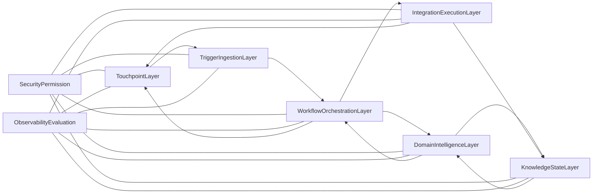
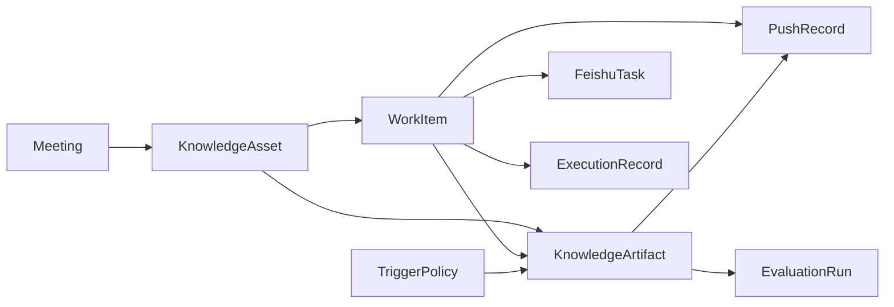

# 办公场景驱动的智能知识助手架构设计说明书

## 1. 文档目的
本文档用于明确“办公场景驱动的智能知识助手”的总体架构设计，作为后续架构讨论、需求对齐、模块拆分和实施落地的基础文档。

本文档重点覆盖：
- 逻辑分层与模块职责
- 关键对象模型
- 关键数据流
- 技术选型建议
- 与需求和 A/B/C/D 四个方向的映射关系

本文档暂不展开：
- 具体代码实现
- 代码目录结构
- 部署拓扑与运维脚本
- API 字段级实现细节

## 2. 项目定位与设计目标

### 2.1 项目定位
本项目不是一个单纯的飞书聊天 Bot，也不是一个仅调用飞书 API 的外部工具，而是一个以飞书办公场景为主战场、由 Agent 驱动的主动知识服务系统。

系统采用“飞书原生交互面 + 外部 Agent 编排内核”的模式：
- 飞书内负责承载文档、妙记、消息、任务、日历、多维表格等数据源与结果触达。
- 飞书外负责事件接入、工作流编排、知识提炼、事项归并、状态管理、评测与观测。

### 2.2 总体目标
- 以 `D` 方向“团队待办中枢与进展自动对账”作为核心主线。
- 以 `B` 方向“会议与项目全链路伴侣”作为首个高频入口场景。
- 以 `A` 方向作为管理层周期性输出面。
- 以 `C` 方向作为研发场景差异化触达面。

### 2.3 关键结果
- 将散落在会议、文档、消息和任务中的信息沉淀为统一事项。
- 将统一事项映射为可追踪、可分派、可预警的推进链路。
- 在恰当时机以卡片、任务、文档、总表、CLI 等形式主动输出。

## 3. 架构设计原则

### 3.1 不重复造轮子
- 飞书基础能力优先复用 `larksuite/cli` 与官方 OpenAPI。
- 不重复实现认证、授权、事件订阅、基础资源 CRUD、妙记/会议/任务基础读取等通用能力。

### 3.2 事件驱动优先
- 架构优先采用“事件触发 + 工作流编排 + 幂等写入 + 可补偿任务”的模式。
- 会议开始、会议结束、日程变更、文档变更、定时任务、CLI 指令都应统一纳入触发体系。

### 3.3 事项中枢优先于纯摘要
- 系统的核心不是生成摘要，而是形成统一事项视图并持续追踪其推进状态。
- 摘要、周报、提醒和 CLI 推送都应以事项中枢为事实基础。

### 3.4 规则与 Agent 协同
- 高风险动作不能完全交给大模型自由决策。
- 系统应采用“规则负责边界控制，LLM 负责理解与生成，人工确认负责高风险兜底”的协同模式。

### 3.5 来源可追溯
- 每条关键结论、事项、风险或提醒都应保留来源文档、会议、消息或任务链接。
- 可追溯性既是可信度要求，也是后续评测、纠错和审计基础。

### 3.6 面向生产化演进
- 首版允许范围收敛，但架构不得依赖一次性脚本。
- 需要从第一天考虑幂等、重试、权限、观测和演进空间。

## 4. 总体逻辑架构



系统分为 **6 层主架构** 与 **2 个横切能力**：
- 主架构：
  - 触点层
  - 触发与接入层
  - 工作流编排层
  - 领域智能层
  - 知识与状态层
  - 集成执行层
- 横切能力：
  - 安全与权限
  - 观测与评测

## 5. 分层设计

## 5.1 触点层
`Touchpoint Layer`

### 职责
- 承接用户可见的最终交互面。
- 展示系统产物。
- 提供人工确认入口。
- 为不同场景提供合适的输出载体。

### 典型载体
- 飞书消息卡片
- 群消息 / 单聊消息
- 飞书任务界面
- 多维表格视图
- 报告文档
- CLI 输出

### 输入
- 编排层与领域智能层生成的最终产物。
- 集成执行层写回后的状态回执。

### 输出
- 用户可见的卡片、消息、任务、报告、表格和终端提示。
- 用户确认、认领、驳回、补充输入等交互结果。

### 不应承担的职责
- 不做复杂业务判断。
- 不做跨源知识抽取。
- 不直接承担流程编排。

### 对应功能
- B：会前背景卡片、会后确认卡片
- D：事项总表视图、负责人提醒、风险卡片
- A：周报、周洞察、管理层摘要
- C：CLI 提示与即时知识推送

### 核心卡片交互设计

#### 卡片一：会前背景卡片
- **触发时机**：会议开始前 10 分钟（由日历事件触发）
- **发送对象**：会议参与人所在群 / 会议关联群
- **卡片结构**：
  - 标题区：会议名称 + 时间
  - 历史决策区：与本次会议主题相关的历史决策事项（最近 3 条），每条附来源链接
  - 未结事项区：与参会人相关的未完成 WorkItem 列表
  - 相关文档区：由语义检索召回的相关知识资产链接
- **交互按钮**：
  - `查看详情`：跳转到完整背景文档
  - `补充议题`：触发回调，允许用户追加文本（回调写入 KnowledgeAsset）
- **回调路由**：`POST /callback/card/pre_meeting` → workflow 模块 → 更新 KnowledgeArtifact

#### 卡片二：会后确认卡片
- **触发时机**：会议结束后，妙记/纪要就绪时
- **发送对象**：会议参与人（单聊或群聊）
- **卡片结构**：
  - 标题区：会议名称 + "会后事项确认"
  - 事项列表区：每个抽取的 WorkItem 一行，显示 title、itemType 标签、推断的 owner 和 dueAt
  - 每条事项后附 `置信度` 标签（高/中/低）
- **交互按钮（每条事项）**：
  - `确认`：状态从 `pending_review` → `active`，自动创建飞书任务
  - `修改`：弹出表单，允许修改 title / owner / dueAt / priority
  - `驳回`：状态 → `closed`，记录驳回原因
- **交互按钮（卡片底部）**：
  - `全部确认`：批量确认所有事项
  - `补充遗漏`：触发文本输入，新增一条 WorkItem
- **回调路由**：`POST /callback/card/post_meeting_confirm` → workflow 模块 → 更新 WorkItem 状态 + 创建飞书任务

#### 卡片三：风险预警卡片
- **触发时机**：定时巡检发现超期/阻塞/长期未推进事项时
- **发送对象**：事项负责人（单聊）或团队群
- **卡片结构**：
  - 标题区："风险预警" + 时间戳
  - 风险事项列表：每条显示 title、当前状态、超期天数或阻塞原因
  - 每条附来源链接（原始会议/文档/消息）
- **交互按钮（每条事项）**：
  - `认领处理`：指派自己为 owner，状态 → `active`
  - `标注进展`：弹出文本输入，追加处理说明
  - `升级上报`：将事项推送给上级管理者
- **回调路由**：`POST /callback/card/risk_alert` → workflow 模块 → 更新 WorkItem + 记录 PushRecord 交互结果

### 卡片回调统一处理流程
```
用户点击卡片按钮
  → 飞书回调 POST 到应用服务
  → trigger 模块接收并生成标准化事件
  → workflow 模块处理（更新 WorkItem / 创建任务 / 补充信息）
  → integration 模块执行飞书写回（任务创建、状态同步）
  → touchpoint 模块更新卡片状态（如按钮置灰、显示确认标记）
```

## 5.2 触发与接入层
`Trigger & Ingestion Layer`

### 职责
- 接收飞书事件、定时任务和命令行触发。
- 将不同来源的触发统一标准化。
- 生成幂等键、做事件去重与入队。
- 为后续工作流提供统一触发上下文。

### 典型触发源
- 会议开始 / 结束
- 日程变更
- 文档编辑
- 邮件同步 / 邮件事件
- 卡片按钮回调
- 定时巡检
- CLI 命令

### 输入
- 飞书事件订阅
- 调度器任务
- 手工触发指令

### 输出
- 标准化事件
- 工作流执行任务
- 原始事件记录

### 不应承担的职责
- 不做事项归并。
- 不做复杂 LLM 推理。
- 不直接做业务写回。

### 对应功能
- B：会议开始触发会前包，会议结束触发会后抽取
- A：定时汇总与周期性洞察
- C：CLI 指令与终端上下文触发
- D：文档变更、任务状态变更、邮件同步、周期性巡检

## 5.3 工作流编排层
`Workflow Orchestration Layer`

### 职责
- 编排各类业务流程。
- 定义执行顺序、重试、补偿和人工确认节点。
- 决定规则节点与 LLM 节点的调用方式。
- 串联知识检索、事项抽取、写回、通知和状态回流。

### 典型流程
- 事项入库与归并流程
- 事项对账与状态同步流程
- 风险巡检与预警流程
- 事项驱动知识产物生成流程
- 会前背景卡片流程
- 会后事项抽取与回写流程
- 周报洞察流程
- CLI 即时知识推送流程

### 输入
- 标准化事件
- 人工确认结果
- 状态层提供的现有事项和执行历史

### 输出
- 对领域层和执行层的有序调用请求
- 流程状态
- 补偿任务

### 不应承担的职责
- 不直接持有底层数据主存。
- 不把所有业务规则写死在单一大 Prompt 中。

### 对应功能
- B：会前卡片、会后纪要到任务流程
- D：事项入库、事项对账、阻塞提醒、推进巡检、事项驱动产物生成
- A：定时汇总与管理洞察
- C：即时检索与推荐流程

## 5.4 领域智能层
`Domain Intelligence Layer`

### 职责
- 对多源内容进行业务理解。
- 抽取决策、待办、风险、阻塞等结构化信息。
- 完成事项归并、去重、字段补齐、优先级推断、责任人推断。
- 生成高密度知识产物，而不是通用摘要。

### 关键能力
- 统一事项识别
- 决策与待办抽取
- 风险与阻塞识别
- 责任人与截止时间补齐
- 来源引用生成

### 输入
- 会议纪要、妙记逐字稿、文档内容、消息内容、任务状态
- 工作流编排上下文
- 状态层已有事项中心数据

### 输出
- 标准化事项对象
- 决策、风险、摘要、提醒等知识产物
- 置信度与待确认字段

### 不应承担的职责
- 不直接操作飞书 API。
- 不承接最终触达与交互。

### 对应功能
- B：会后 Action Item 抽取、决策识别、风险提取
- D：事项归并、状态对账、阻塞识别
- A：趋势洞察和管理层总结
- C：研发问题类型识别与知识映射

## 5.5 知识与状态层
`Knowledge & State Layer`

### 职责
- 作为系统事实基础和系统记忆。
- 存储原始事件、事项中心、任务映射、推送历史、执行历史。
- 为结构化查询、全文检索和语义检索提供支撑。

### 存储对象
- 原始事件记录
- 事项中心
- 任务映射关系
- 来源引用关系
- 推送记录
- 工作流执行记录
- 检索索引

### 输入
- 触发层记录的事件
- 领域层生成的事项对象
- 执行层返回的写回结果

### 输出
- 提供给领域层与编排层的当前状态
- 历史数据、检索结果和执行回执

### 不应承担的职责
- 不承担复杂业务推理。
- 不直接进行外部 API 调用。

### 对应功能
- B：会议知识缓存、会前检索上下文
- D：统一事项中心、任务映射、推进历史
- A：历史事项统计与趋势分析
- C：内部知识检索与相似案例召回

## 5.6 集成执行层
`Integration & Execution Layer`

### 职责
- 屏蔽 `lark-cli`、OpenAPI 与其它外部接口的调用差异。
- 负责读写飞书资源。
- 负责消息、任务、文档、表格等执行动作。

### 原则
- 优先调用 `larksuite/cli`。
- 当 `lark-cli` 未覆盖某一能力时，再直连官方 OpenAPI。

### 典型适配器
- `FeishuMeetingAdapter`
- `FeishuCalendarAdapter`
- `FeishuTaskAdapter`
- `FeishuDocsAdapter`
- `FeishuMessageAdapter`
- `FeishuBitableAdapter`

### 输入
- 编排层下发的执行请求

### 输出
- 飞书资源读取结果
- 任务创建 / 更新结果
- 卡片发送与回调结果
- 文档与总表写回结果

### 不应承担的职责
- 不承载领域判断。
- 不在此层散落复杂流程逻辑。

### 对应功能
- B：会前卡片发送、会议资料拉取、任务写回
- D：总表维护、状态同步、阻塞提醒
- A：周报文档生成、管理卡片推送
- C：CLI 查询与飞书结果回推

## 5.7 横切能力一：安全与权限
`Security & Permission Control`

### 职责
- 区分应用身份与用户身份。
- 控制数据访问边界。
- 对高风险动作增加确认机制。
- 提供审计能力。

### 重点问题
- 日历事件偏用户身份订阅。
- 文档与消息访问存在可见性边界。
- 卡片操作和任务写回需要清晰的权限范围。

## 5.8 横切能力二：观测与评测
`Observability & Evaluation`

### 职责
- 提供业务日志、链路追踪、失败告警。
- 记录 LLM 质量、抽取准确率、用户接受度和流程成功率。
- 支撑后续效果验证报告。

### 关键指标
- 每次触发成功率
- 事项抽取准确率
- 补偿成功率
- 卡片点击率
- 任务认领率
- 会后处理耗时下降比例

## 6. 关键对象模型

## 6.1 双核心业务实体
建议系统采用 **`WorkItem` + `KnowledgeArtifact` 双核心模型**：

- `WorkItem`
  - 统一事项对象，是系统执行闭环的核心事实单位。
- `KnowledgeArtifact`
  - 系统生成的高密度知识产物，是主动服务与多形态输出的核心表达对象。

两者分别解决不同问题：
- `WorkItem` 负责“推进什么、谁负责、何时到期、当前状态如何”。
- `KnowledgeArtifact` 负责“在当前场景下，向谁输出什么高密度知识，以及以什么形式输出”。

## 6.2 支撑业务实体
除双核心外，系统还应统一抽象以下支撑对象：

- `KnowledgeAsset`
  - 被检索与引用的原始知识资产，如文档、妙记、消息、会议纪要、邮件。
- `SourceReference`
  - 事项或知识产物与来源内容之间的映射关系。
- `TaskBinding`
  - 事项与飞书任务或多维表格记录之间的绑定关系。
- `TriggerPolicy`
  - 主动触发与分发策略对象。
- `HumanReviewTask`
  - 高风险或低置信度结果的人工确认任务。
- `ExecutionRecord`
  - 某次工作流执行、写回、推送的过程记录。
- `PushRecord`
  - 某次消息卡片、提醒、CLI 推送的投递记录。
- `EvaluationCase`
  - 评测用例定义。
- `EvaluationRun`
  - 某次评测执行结果。
- `MetricSnapshot`
  - 某时间窗口的业务与效果指标快照。

## 6.3 WorkItem 建议字段
- `id`
- `title`
- `itemType`
  - 决策 / 待办 / 风险 / 阻塞 / 背景知识
- `status`
  - 新建 / 待确认 / 进行中 / 已完成 / 已阻塞 / 已关闭
- `priority`
- `owner`
- `dueAt`
- `sourceType`
  - meeting / minutes / doc / wiki / im / task / mail
- `sourceRefs`
- `linkedTaskId`
- `confidence`
- `needHumanConfirm`
- `createdAt`
- `updatedAt`

## 6.4 KnowledgeArtifact 建议类型
- `pre_meeting_brief`
- `meeting_summary`
- `risk_report`
- `weekly_insight`
- `cli_hint`
- `task_digest`

## 6.5 TriggerPolicy 建议职责
- 定义触发类型：定时 / 事件 / 阈值 / 人工
- 定义触发来源：会议、文档、消息、任务、邮件、CLI
- 定义分发对象：个人、群、部门、终端本地
- 定义触达形式：卡片、消息、文档、总表、CLI
- 定义是否需要人工确认以及确认阈值

## 6.6 关键关系
- 一个会议可产生多个事项。
- 一个事项可引用多个来源资产。
- 一个事项可映射到一个或多个飞书任务。
- 一个事项可派生多个知识产物。
- 一个知识产物可由触发策略驱动生成并分发。
- 一个事项可被多次推送、确认和更新。



## 7. 关键数据流

## 7.1 数据流一：事项入库与归并链路（D 主轴）

### 目标
从会议、文档、消息、任务、评论、邮件等来源识别事项，并沉淀为统一事项中心。


### 分层落点
- 触发与接入层：接收会议、文档、消息、任务、邮件等来源触发。
- 集成执行层：拉取对应知识资产。
- 领域智能层：抽取事项并做初步结构化。
- 知识与状态层：做事项归并、去重、状态初始化与持久化。

### 邮件来源路径说明
邮件作为 D 方向的一种触发源和知识资产类型，纳入本数据流处理：
- 触发与接入层：接收邮件到达事件（通过 `lark-event` 订阅邮件事件，或由定时任务轮询 `lark-mail`）。
- 集成执行层：通过 `lark-mail` skill 拉取邮件正文、附件摘要和邮件线索 ID。
- 领域智能层：从邮件正文中抽取事项（复用与会议纪要相同的 WorkItem 抽取 Prompt，`originChannel = 'mail'`）。
- 知识与状态层：将邮件作为 KnowledgeAsset（`assetType = 'mail'`）入库，将抽取的事项与已有事项做归并。

## 7.2 数据流二：事项对账与状态同步链路（D 主轴）

### 目标
让事项中心与飞书任务、多维表格、来源状态持续同步。


### 分层落点
- 知识与状态层：提供事项中心当前状态与绑定关系。
- 工作流编排层：启动对账流程、补偿和重试。
- 集成执行层：更新飞书任务与总表。
- 触点层：必要时向负责人或群发送更新提醒。

## 7.3 数据流三：会前背景卡片链路（B 入口）

### 目标
在会议开始前，为参与人或相关群推送高密度背景知识。


### 分层落点
- 触发与接入层：接收会议开始或日程变更事件。
- 工作流编排层：启动会前准备流程。
- 集成执行层：检索日历、会议、文档、任务和消息。
- 领域智能层：生成会前背景摘要、历史决策和待关注风险。
- 触点层：发送会前背景卡片。

## 7.4 数据流四：会后事项抽取与任务回写链路（B -> D）

### 目标
在会议结束后，将决策、待办和风险沉淀为统一事项，并自动创建或更新飞书任务。


### 分层落点
- 触发与接入层：接收会议结束事件。
- 集成执行层：拉取妙记、逐字稿、纪要和关联资料。
- 领域智能层：抽取事项、风险和决策。
- 知识与状态层：与已有事项做归并、去重和状态对账。
- 集成执行层：创建或更新飞书任务与统一推进总表。
- 触点层：发送会后确认卡片。

## 7.5 数据流五：周期性管理洞察链路（D -> A）

### 目标
按日或按周对事项中心进行统计，输出团队推进洞察与风险预警。


### 分层落点
- 触发与接入层：定时任务触发。
- 知识与状态层：提供事项中心和执行历史。
- 领域智能层：进行趋势分析、风险聚合和管理洞察生成。
- 触点层：输出周报文档与管理卡片。

## 7.6 数据流六：CLI 即时知识推送链路（C 扩展）

### 目标
在开发者终端出现特定命令、错误或上下文时，即时返回相关知识。

### 分层落点
- 触发与接入层：接收 CLI 命令或终端上下文。
- 工作流编排层：启动即时查询流程。
- 领域智能层：识别问题类型并映射内部知识。
- 知识与状态层：检索相似历史案例、文档和事项。
- 触点层：CLI 返回结果，必要时同步飞书推送。

## 8. 技术选型建议

## 8.1 飞书能力底座
推荐方案：
- 第一优先级：`larksuite/cli`
- 第二优先级：官方 OpenAPI

原因：
- 已覆盖会议、妙记、任务、文档、消息、日历、Base、事件等核心能力。
- 能显著降低底层接入成本。
- 已提供 `lark-workflow-meeting-summary`、`lark-workflow-standup-report` 等可参考工作流。

## 8.2 事件接入
候选方案：
- `lark-event`
- 官方长连接 SDK
- Webhook

推荐：
- 当前阶段优先考虑 `lark-event` 或官方长连接 SDK。
- 若需要对外暴露回调地址、接入更多外部系统，再考虑 Webhook 模式。

## 8.3 工作流编排
推荐方案：
- `Trigger.dev`

理由：
- TypeScript 原生，与项目语言生态一致。
- 自带任务调度、重试、补偿、Dashboard 可视化和日志追踪，开箱即用。
- 支持 cron 定时任务、事件触发和人工确认等多种触发模式，与本项目编排层需求高度匹配。
- 相比 BullMQ 需要自建 Worker、Dashboard 和补偿逻辑，Trigger.dev 的集成度更高，更适合比赛周期。

演进备选：
- 若后续流程数量、人工节点和补偿复杂度明显上升，可演进到 `Temporal`。

## 8.4 主存储与状态中心
推荐组合：
- `PostgreSQL`
- `Redis`

职责建议：
- `PostgreSQL`：事项中心、任务映射、执行记录、引用关系、审计记录。
- `Redis`：队列、短期缓存、事件幂等键、工作流状态辅助缓存。

## 8.5 检索层
推荐组合：
- 第一阶段：`PostgreSQL Full Text Search + 元数据过滤`
- 第二阶段：`pgvector` 或 `Qdrant`

理由：
- 本项目核心是“事项状态与闭环”，不是纯粹语义问答。
- 应先保证结构化状态中心，再补充语义检索增强。

## 8.6 观测与评测
推荐组合：
- 结构化日志
- `OpenTelemetry`
- `Langfuse`

职责：
- 日志：业务行为与失败记录。
- OpenTelemetry：跨工作流与外部调用链路追踪。
- Langfuse：Prompt、LLM 输出质量与评测观察。

## 8.7 技术选型结论
当前阶段建议采用：
- 语言生态：`TypeScript / Node.js`
- 飞书能力底座：`larksuite/cli` + 必要 OpenAPI
- 编排：`Trigger.dev`
- 主存储：`PostgreSQL`
- 缓存与幂等：`Redis`
- 检索：`PostgreSQL FTS + pgvector`
- LLM 集成：`OpenClaw`（底层模型 Doubao 2.0 Pro）
- 观测：结构化日志 + `OpenTelemetry` + `Langfuse`

这是当前阶段在落地速度、工程复杂度和生产化可演进性之间最平衡的组合。

## 8.8 LLM 集成设计

### 模型选型
- 主力模型：`OpenClaw`（底层 Doubao 2.0 Pro）
- OpenClaw 是飞书生态内置的 Agent 能力平台，与飞书 API 和 CLI 深度集成
- Doubao 2.0 Pro 在中文理解、指令跟随和结构化输出方面表现优秀，适合本项目的事项抽取和知识提炼场景

### 核心调用场景

| 场景 | 输入 | 输出 | 质量要求 |
| --- | --- | --- | --- |
| 会后事项抽取 | 会议纪要/妙记逐字稿 | 结构化 WorkItem 列表（含 title、itemType、owner、dueAt 等） | 高：直接影响事项入库准确率 |
| 事项归并判断 | 新抽取事项 + 已有事项列表 | 归并/新建决策 + 归并理由 | 高：误合并不可逆 |
| 会前背景生成 | 参与人、议题、历史事项和文档摘要 | 结构化背景卡片内容 | 中：辅助性质 |
| 风险识别 | 事项状态快照 + 时间窗口 | 风险等级 + 阻塞原因 + 缓解建议 | 中 |
| 周报洞察 | 本周事项统计 + 状态变更记录 | 管理洞察报告 | 中 |
| CLI 知识匹配 | 终端上下文/错误信息 | 相关文档/事项推荐 | 低：容忍模糊匹配 |

### Prompt 管理策略
- 采用 **模板文件 + 变量注入** 的方式管理 Prompt
- Prompt 模板存储在代码仓库 `src/domain/prompts/` 目录下，按场景分文件
- 每个模板包含系统指令（system）和用户指令（user）两部分
- 变量通过模板引擎注入（如 Handlebars 或简单字符串替换）
- 模板版本跟随 Git 版本控制，配合 Langfuse 记录实际使用的模板内容

### 结构化输出策略
- 所有 LLM 调用均要求返回 **JSON 格式** 的结构化输出
- 在 Prompt 中明确定义输出 JSON Schema，包括字段名、类型和枚举值
- 应用层对 LLM 返回的 JSON 做 Schema 校验（使用 Zod 或 AJV）
- 校验失败时进行一次重试，仍失败则标记为 `needHumanConfirm = true`

### 知识提纯管道（三层）
1. **预过滤层**：基于时间窗口、参与人、关键词对原始内容做粗筛，减少输入 Token
2. **结构化抽取层**：LLM 从粗筛内容中抽取事项（WorkItem）和知识产物（KnowledgeArtifact）
3. **场景化排序层**：根据当前触发上下文（如即将召开的会议主题）对抽取结果做相关性排序

### Token 预算与降级
- 单次调用输入 Token 上限建议 8000（留出输出空间）
- 超长文档先分段摘要，再对摘要结果做二次抽取
- LLM 不可用或超时（>30s）时，跳过抽取步骤，记录执行失败，由下一轮巡检补偿
- 低置信度结果（confidence < 0.6）自动标记为 `needHumanConfirm = true`

### 调用链路
```
工作流编排层（Trigger.dev Task）
  → 构造 Prompt 上下文（domain 模块）
    → 注入模板变量
    → 调用 OpenClaw API
    → 解析 JSON 响应
    → Schema 校验（Zod）
    → 写入 WorkItem / KnowledgeArtifact
    → 记录到 Langfuse（Prompt 版本、输入输出、耗时、Token 数）
```

## 9. 复用边界与自研边界

## 9.1 直接复用 `larksuite/cli` 的能力
- 认证、授权和 scope 管理
- 事件接入与订阅
- 会议与妙记读取
- 日历与任务基础读取写回
- 文档、消息、知识库、Base 的基础读写
- 常见工作流模板与 API 探索

## 9.2 必须自研的应用层能力
- 跨源事项归并、去重与字段补齐
- 事项状态对账与阻塞识别
- 场景化知识提纯
- 主动触发规则和提醒策略
- 统一事项中心数据模型
- 评测、观测和业务指标体系

## 10. 与需求的映射关系

| 需求能力 | 主要架构层 | 说明 |
| --- | --- | --- |
| 多源知识接入 | 触发与接入层、集成执行层、知识与状态层 | 统一事件入口与知识接入能力 |
| 会前知识卡片 | 编排层、领域层、触点层 | B 方向高频入口 |
| 会后事项抽取 | 编排层、领域层 | 从会议走向事项中枢 |
| 事项中枢与对账 | 领域层、状态层 | D 方向核心 |
| 周报与洞察 | 状态层、领域层、触点层 | A 方向输出面 |
| CLI 碎片知识推送 | 触发层、编排层、领域层、触点层 | C 方向扩展 |
| 任务创建与状态同步 | 集成执行层、状态层 | 执行闭环核心 |
| 卡片确认与人工兜底 | 触点层、编排层 | 高风险动作确认 |
| 评测与可观测 | 观测与评测层 | 贯穿所有层 |

## 11. A/B/C/D 四方向的架构落点

### A：周期性智能总结与洞察
- 依赖事项中枢和执行历史。
- 主要落在知识与状态层、领域智能层、触点层。

### B：会议与项目的全链路伴侣
- 作为高频入口场景。
- 主要落在触发与接入层、编排层、领域层、触点层。

### C：沉浸式碎片知识推送助手
- 作为研发场景扩展触达面。
- 主要落在触发与接入层、编排层、领域层、触点层。

### D：团队待办中枢与进展自动对账
- 作为系统主线与统一骨架。
- 主要落在领域智能层、知识与状态层、集成执行层。

## 12. 风险与演进路径

## 12.1 当前主要风险
- 日历、消息、文档等不同域的权限模型复杂。
- 飞书事件存在重复投递，需要幂等设计。
- 跨源事项归并和去重是核心难点。
- 会后抽取结果可能存在误判，需要人工确认机制。
- 卡片交互和多次状态回写要避免与任务状态产生冲突。

## 12.2 MVP 交付范围与分阶段时间线

### P0 阶段：核心闭环（预计 3 天）
**目标**：会后事项抽取 → WorkItem 入库 → 飞书任务创建 → 确认卡片，端到端可演示。

交付范围：
- 环境搭建：PostgreSQL + Redis + Trigger.dev + lark-cli 授权
- 数据库初始化：执行 `schema.sql`
- `integration` 模块：会议/妙记读取适配器、任务创建适配器、消息发送适配器
- `domain` 模块：会后事项抽取 Prompt + JSON 解析 + WorkItem 入库
- `workflow` 模块：会议结束事件 → 抽取 → 入库 → 创建任务 → 发送确认卡片
- `trigger` 模块：接收会议结束事件（lark-event）
- `touchpoint` 模块：会后确认卡片渲染 + 按钮回调处理

验收标准：
- 一场真实会议结束后，系统自动抽取事项、创建飞书任务并发送确认卡片
- 用户可通过卡片确认/驳回/修改事项

### P1 阶段：事项中枢（预计 2 天）
**目标**：事项归并去重 + 多维表格总表投影 + 状态对账。

交付范围：
- `domain` 模块：事项归并判断 Prompt + 去重逻辑
- `integration` 模块：Base 适配器（lark-base），总表写入
- `workflow` 模块：事项对账流程（WorkItem ↔ 飞书任务状态同步）
- `workflow` 模块：定时巡检流程（识别超期/阻塞事项）
- `touchpoint` 模块：风险预警卡片

验收标准：
- 多次会议产生的重复事项可被正确归并
- 统一推进总表（多维表格）自动维护
- 超期事项触发预警卡片

### P2 阶段：主动输出（预计 2 天）
**目标**：会前背景卡片 + 周期性管理洞察。

交付范围：
- `trigger` 模块：日历事件触发（会前 10 分钟）
- `domain` 模块：会前背景生成 Prompt + 知识检索
- `workflow` 模块：会前背景卡片流程 + 周报洞察流程
- `touchpoint` 模块：会前背景卡片 + 周报卡片
- `integration` 模块：日历适配器、文档/知识库检索适配器

验收标准：
- 会议开始前自动推送背景卡片
- 每周自动生成管理洞察并推送到指定群

### P3 阶段：扩展触达（预计 1 天）
**目标**：CLI 即时知识推送。

交付范围：
- `trigger` 模块：CLI 命令入口
- `domain` 模块：问题类型识别 + 知识匹配
- `touchpoint` 模块：CLI 格式化输出

### P4 阶段：效果验证（预计 2 天）
**目标**：评测用例执行 + 效果验证报告输出。

交付范围：
- `evaluation` 模块：评测用例定义 + 批量执行 + 指标采集
- 人工标注 3–5 场会议的标准事项列表
- 执行准确率/召回率/F1 评测
- 输出效果验证报告文档

### 总计预计 10 个工作日
环境配置和飞书应用审批可能额外需要 1–2 天。

## 13. 架构结论
- 系统应采用 **6 层主架构 + 2 个横切能力** 的设计。
- 系统中心应是“事项中枢”，而不是单一会议摘要能力。
- `B` 是入口，`D` 是骨架，`A` 和 `C` 是两类输出面。
- LLM 集成使用 OpenClaw + Doubao 2.0 Pro，采用 JSON 结构化输出 + Zod 校验。
- 飞书基础能力优先复用 `larksuite/cli`，自研重点应放在事项归并、知识提炼、主动推送和效果验证。
- 数据库采用 12 张表的精简设计，子类型差异用 JSONB 承载。
- 模块合并为 6 个（trigger / workflow / domain / integration / touchpoint / evaluation）。
