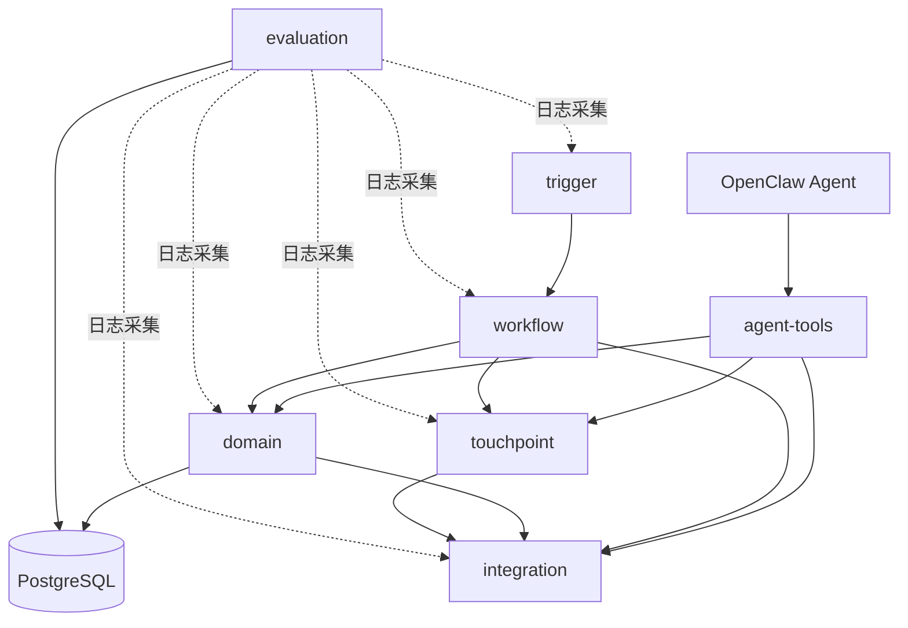

# 模块接口文档

> 状态说明：本文档描述目标接口和后续整改方向，不代表所有接口已经实现。当前代码中 `agent-tools` 已经是与 OpenClaw 对接的一等入口，卡片回调、会前背景、文档/邮件等接口仍处于目标设计阶段。

## 1. 模块依赖关系



调用规则：
- `OpenClaw` 是 Agent 主体，负责选择并调用 `agent-tools`。
- `agent-tools` 是 OpenClaw Skill 调用 FeishuAgent 能力的 HTTP 工具入口。
- `trigger` 只调用 `workflow`（通过 Trigger.dev 任务派发）
- `workflow` 作为后台确定性编排中心，调用 `domain`、`integration`、`touchpoint`
- `domain` 原则上不应直接调用 `integration` 做外部副作用；需要读取外部知识资产时由 application service / workflow 协调
- `touchpoint` 可直接调用 `integration`（发送消息/卡片）
- `evaluation` 是横切模块，通过 logger 被所有模块调用
- 任何模块都不应反向调用 `trigger` 或 `workflow`

---

## 2. 共享类型定义

所有模块共用的类型放在 `src/shared/types.ts`。以下是核心类型：

### 2.1 枚举常量

```typescript
const ItemType = { Todo: "todo", Decision: "decision", Risk: "risk", Blocker: "blocker" } as const
type ItemType = typeof ItemType[keyof typeof ItemType]

const ItemStatus = { New: "new", PendingReview: "pending_review", Active: "active", Blocked: "blocked", Done: "done", Closed: "closed" } as const
type ItemStatus = typeof ItemStatus[keyof typeof ItemStatus]

const Priority = { Low: "low", Medium: "medium", High: "high", Critical: "critical" } as const
type Priority = typeof Priority[keyof typeof Priority]

const OriginChannel = { Meeting: "meeting", Minutes: "minutes", Doc: "doc", Wiki: "wiki", Im: "im", Task: "task", Mail: "mail" } as const
type OriginChannel = typeof OriginChannel[keyof typeof OriginChannel]

const ArtifactType = { PreMeetingBrief: "pre_meeting_brief", MeetingSummary: "meeting_summary", RiskReport: "risk_report", WeeklyInsight: "weekly_insight", CliHint: "cli_hint", TaskDigest: "task_digest" } as const
type ArtifactType = typeof ArtifactType[keyof typeof ArtifactType]

const DeliveryChannel = { Card: "card", Im: "im", Doc: "doc", Base: "base", Cli: "cli" } as const
type DeliveryChannel = typeof DeliveryChannel[keyof typeof DeliveryChannel]
```

### 2.2 核心业务对象

```typescript
interface WorkItem {
  id: string
  title: string
  itemType: ItemType
  status: ItemStatus
  priority: Priority | null
  ownerUserId: string | null
  ownerSource: "manual" | "inferred" | "inherited" | null
  dueAt: Date | null
  confidenceScore: number | null
  needHumanConfirm: boolean
  originChannel: OriginChannel
  originContextId: string
  dedupeKey: string | null
  metadata: Record<string, unknown>
  firstDetectedAt: Date | null
  lastDetectedAt: Date | null
  createdAt: Date
  updatedAt: Date
}

interface KnowledgeAsset {
  id: string
  assetType: string
  sourceId: string
  title: string | null
  contentText: string | null
  ownerUserId: string | null
  createdAt: Date
}

interface KnowledgeArtifact {
  id: string
  artifactType: ArtifactType
  title: string | null
  summary: string | null
  contentPayload: Record<string, unknown> | null
  canonicalRenderFormat: "card" | "doc" | "table" | "cli_text"
  status: "draft" | "ready" | "published" | "expired" | "archived"
  confidenceScore: number | null
  generatedAt: Date | null
  createdAt: Date
}
```

### 2.3 触发事件

```typescript
interface TriggerEvent {
  eventId: string
  eventType: string            // "meeting_end" | "meeting_start" | "doc_edit" | "task_change" | "mail_sync" | "card_callback" | "cron" | "cli"
  source: "feishu_event" | "cron" | "cli" | "card_callback"
  idempotencyKey: string
  payload: Record<string, unknown>
  occurredAt: Date
  receivedAt: Date
}
```

---

## 3. trigger 模块

实现状态：

| 接口 | 状态 |
| --- | --- |
| `normalizeFeishuEvent` | 已实现 |
| `normalizeCardCallback` | 未实现，阶段2需要补齐 |
| `normalizeCLICommand` | 已定义，运行入口未接线 |
| `dispatchToWorkflow` | 已实现会议结束事件分发，仍需改为注册表 |

### 职责
接收外部输入（飞书事件、定时任务、CLI 命令、卡片回调），标准化为 `TriggerEvent`，派发到 workflow 模块。

### 接口

#### `normalizeFeishuEvent`
将飞书原始事件转为标准 TriggerEvent。

```typescript
function normalizeFeishuEvent(rawEvent: FeishuRawEvent): TriggerEvent
```

| 参数 | 类型 | 说明 |
|---|---|---|
| rawEvent | FeishuRawEvent | 飞书推送的原始事件 JSON |
| **返回** | TriggerEvent | 标准化后的触发事件 |

#### `normalizeCardCallback`
将卡片按钮回调转为标准 TriggerEvent。

```typescript
function normalizeCardCallback(callbackPayload: CardCallbackPayload): TriggerEvent
```

| 参数 | 类型 | 说明 |
|---|---|---|
| callbackPayload | CardCallbackPayload | 飞书卡片回调的 JSON body |
| **返回** | TriggerEvent | 标准化后的触发事件，eventType 为 "card_callback" |

#### `normalizeCLICommand`
将 CLI 输入转为标准 TriggerEvent。

```typescript
function normalizeCLICommand(command: string, args: Record<string, string>): TriggerEvent
```

#### `dispatchToWorkflow`
将标准化事件派发到 Trigger.dev 工作流。

```typescript
function dispatchToWorkflow(event: TriggerEvent): Promise<{ runId: string }>
```

#### `checkIdempotency`
检查事件是否已处理过（基于 Redis 幂等键）。

```typescript
function checkIdempotency(key: string): Promise<boolean>
```

### 依赖类型

```typescript
interface FeishuRawEvent {
  schema: string
  header: { event_id: string; event_type: string; create_time: string }
  event: Record<string, unknown>
}

interface CardCallbackPayload {
  open_id: string
  action: { tag: string; value: Record<string, string> }
  token: string
  open_message_id: string
}
```

---

## 4. workflow 模块

### 职责
定义 Trigger.dev 后台工作流任务。接收 TriggerEvent，按流程编排调用 domain、integration、touchpoint。Trigger.dev 不取代 OpenClaw 的 Agent 主体角色。

实现状态：

| 流程 | 状态 |
| --- | --- |
| `postMeetingExtractionFlow` | 已实现雏形 |
| `preMeetingBriefFlow` | 未实现完整链路 |
| `cardCallbackFlow` | 未实现，阶段2重点 |
| `riskInspectionFlow` | 已实现雏形 |
| `weeklyInsightFlow` | 已实现雏形 |
| `itemReconciliationFlow` | 已实现雏形 |

### 接口

每个工作流是一个 Trigger.dev task，接收 TriggerEvent 作为 payload。

#### `postMeetingExtractionFlow`
会后事项抽取主流程。

```typescript
// Trigger.dev task 定义
const postMeetingExtractionFlow = task({
  id: "post-meeting-extraction",
  run: async (event: TriggerEvent) => PostMeetingResult
})
```

内部编排步骤：
1. 调用 `integration.meeting.getMinutes(meetingId)` 拉取妙记
2. 调用 `domain.extraction.extractWorkItems(minutesContent, participants)` 抽取事项
3. 调用 `domain.workItem.reconcileAndSave(extractedItems)` 归并入库
4. 调用 `integration.task.createFeishuTasks(savedItems)` 创建飞书任务
5. 调用 `touchpoint.card.sendPostMeetingConfirmCard(savedItems, chatId)` 发送确认卡片

```typescript
interface PostMeetingResult {
  extractedCount: number
  savedCount: number
  tasksCreated: string[]
  cardMessageId: string
}
```

#### `preMeetingBriefFlow`
会前背景卡片流程。

```typescript
const preMeetingBriefFlow = task({
  id: "pre-meeting-brief",
  run: async (event: TriggerEvent) => PreMeetingResult
})
```

内部编排步骤：
1. 调用 `integration.calendar.getEventDetail(eventId)` 获取日程详情
2. 调用 `domain.workItem.findRelatedItems(participants, topic)` 查找相关事项
3. 调用 `domain.artifact.generatePreMeetingBrief(eventDetail, relatedItems)` 生成背景产物
4. 调用 `touchpoint.card.sendPreMeetingCard(brief, chatId)` 发送卡片

```typescript
interface PreMeetingResult {
  artifactId: string
  cardMessageId: string
}
```

#### `cardCallbackFlow`
卡片回调处理流程。

```typescript
const cardCallbackFlow = task({
  id: "card-callback",
  run: async (event: TriggerEvent) => CardCallbackResult
})
```

内部编排步骤：
1. 解析 action.value 确定操作类型（confirm / reject / modify / claim）
2. 根据操作类型调用 `domain.workItem.updateStatus(...)` 或 `domain.workItem.update(...)`
3. 如需创建飞书任务，调用 `integration.task.createFeishuTask(...)`
4. 调用 `touchpoint.card.updateCardState(messageId, newState)` 更新卡片显示

```typescript
interface CardCallbackResult {
  action: string
  workItemId: string
  newStatus: ItemStatus | null
  taskCreated: string | null
}
```

#### `riskInspectionFlow`
风险巡检流程（定时触发）。

```typescript
const riskInspectionFlow = task({
  id: "risk-inspection",
  run: async (event: TriggerEvent) => RiskInspectionResult
})
```

内部编排步骤：
1. 调用 `domain.workItem.findOverdueAndBlocked()` 查询超期/阻塞事项
2. 调用 `domain.artifact.generateRiskReport(riskyItems)` 生成风险产物
3. 调用 `touchpoint.card.sendRiskAlertCards(report, owners)` 发送预警卡片

```typescript
interface RiskInspectionResult {
  overdueCount: number
  blockedCount: number
  alertsSent: number
}
```

#### `weeklyInsightFlow`
周报洞察流程（定时触发）。

```typescript
const weeklyInsightFlow = task({
  id: "weekly-insight",
  run: async (event: TriggerEvent) => WeeklyInsightResult
})
```

#### `itemReconciliationFlow`
事项对账流程（定时触发）。

```typescript
const itemReconciliationFlow = task({
  id: "item-reconciliation",
  run: async (event: TriggerEvent) => ReconciliationResult
})
```

内部编排步骤：
1. 调用 `domain.workItem.listActiveItems()` 获取活跃事项
2. 调用 `integration.task.getFeishuTaskStatuses(taskIds)` 拉取飞书任务状态
3. 调用 `domain.workItem.syncStatuses(items, feishuStatuses)` 同步状态
4. 调用 `integration.base.updateBitableRecords(changedItems)` 更新总表

---

## 5. domain 模块

### 职责
核心业务逻辑。包含事项管理、知识资产管理、知识产物生成、LLM 调用。

### 子模块：`domain.workItem`

#### `extractWorkItems`
从文本内容中通过 LLM 抽取事项列表。

```typescript
async function extractWorkItems(
  content: string,
  participants: FeishuUser[],
  originChannel: OriginChannel,
  originContextId: string,
): Promise<ExtractedWorkItem[]>
```

| 参数 | 类型 | 说明 |
|---|---|---|
| content | string | 会议纪要/文档/邮件正文 |
| participants | FeishuUser[] | 相关人员列表（用于负责人推断） |
| originChannel | OriginChannel | 来源渠道 |
| originContextId | string | 来源 ID（如 meeting_id） |
| **返回** | ExtractedWorkItem[] | LLM 抽取并经 Schema 校验后的事项列表 |

```typescript
interface ExtractedWorkItem {
  title: string
  itemType: ItemType
  ownerName: string | null
  dueAt: string | null           // ISO 日期字符串，LLM 原始输出
  priority: Priority | null
  confidenceScore: number
  metadata: Record<string, unknown>
}
```

#### `reconcileAndSave`
将抽取的事项与已有事项做归并，然后入库。

```typescript
async function reconcileAndSave(
  extracted: ExtractedWorkItem[],
  originChannel: OriginChannel,
  originContextId: string,
): Promise<WorkItem[]>
```

| 参数 | 类型 | 说明 |
|---|---|---|
| extracted | ExtractedWorkItem[] | 待入库的事项列表 |
| originChannel | OriginChannel | 来源渠道 |
| originContextId | string | 来源 ID |
| **返回** | WorkItem[] | 入库后的事项列表（含 id） |

内部逻辑：
1. 为每条事项生成 dedupeKey
2. 查询已有事项，通过 dedupeKey 或 LLM 判断是否需要归并
3. 新事项 INSERT，归并事项 UPDATE
4. 写入 source_references
5. 写入 work_item_audit_log

#### `updateStatus`
更新事项状态（含状态机校验）。

```typescript
async function updateStatus(
  workItemId: string,
  newStatus: ItemStatus,
  changedBy: { type: "workflow" | "human" | "sync"; id: string },
  reason?: string,
): Promise<WorkItem>
```

#### `update`
更新事项字段。

```typescript
async function update(
  workItemId: string,
  fields: Partial<Pick<WorkItem, "title" | "priority" | "ownerUserId" | "dueAt" | "metadata">>,
  changedBy: { type: "workflow" | "human" | "sync"; id: string },
): Promise<WorkItem>
```

#### `findRelatedItems`
按参与人和主题查找相关事项。

```typescript
async function findRelatedItems(
  userIds: string[],
  topic: string | null,
  statusFilter?: ItemStatus[],
): Promise<WorkItem[]>
```

#### `findOverdueAndBlocked`
查找超期和阻塞事项。

```typescript
async function findOverdueAndBlocked(): Promise<{ overdue: WorkItem[]; blocked: WorkItem[] }>
```

#### `listActiveItems`
列出所有活跃事项。

```typescript
async function listActiveItems(filters?: {
  ownerUserId?: string
  itemType?: ItemType
  limit?: number
}): Promise<WorkItem[]>
```

#### `syncStatuses`
将外部状态（飞书任务）同步回事项中心。

```typescript
async function syncStatuses(
  items: WorkItem[],
  externalStatuses: Map<string, string>,
): Promise<WorkItem[]>
```

### 子模块：`domain.asset`

#### `ingestAsset`
将原始知识资产入库。

```typescript
async function ingestAsset(
  assetType: string,
  sourceId: string,
  title: string,
  contentText: string,
  ownerUserId?: string,
): Promise<KnowledgeAsset>
```

#### `findBySourceId`

```typescript
async function findBySourceId(sourceId: string): Promise<KnowledgeAsset | null>
```

### 子模块：`domain.artifact`

#### `generatePreMeetingBrief`
生成会前背景产物。

```typescript
async function generatePreMeetingBrief(
  eventDetail: CalendarEventDetail,
  relatedItems: WorkItem[],
  relatedAssets: KnowledgeAsset[],
): Promise<KnowledgeArtifact>
```

#### `generateMeetingSummary`
生成会后结构化摘要产物。

```typescript
async function generateMeetingSummary(
  minutesContent: string,
  extractedItems: WorkItem[],
  meetingTitle: string,
): Promise<KnowledgeArtifact>
```

#### `generateRiskReport`
生成风险洞察报告。

```typescript
async function generateRiskReport(
  overdueItems: WorkItem[],
  blockedItems: WorkItem[],
): Promise<KnowledgeArtifact>
```

#### `generateWeeklyInsight`
生成周报洞察。

```typescript
async function generateWeeklyInsight(
  weekRange: { from: Date; to: Date },
  allItems: WorkItem[],
): Promise<KnowledgeArtifact>
```

### 子模块：`domain.llm`

#### `callOpenClaw`
统一的 LLM 调用入口。

```typescript
async function callOpenClaw<T>(
  promptTemplate: string,
  variables: Record<string, unknown>,
  outputSchema: ZodSchema<T>,
): Promise<{ data: T; tokenUsage: { input: number; output: number } }>
```

| 参数 | 类型 | 说明 |
|---|---|---|
| promptTemplate | string | Prompt 模板名称（对应 `src/domain/prompts/` 下的文件） |
| variables | Record<string, unknown> | 注入模板的变量 |
| outputSchema | ZodSchema\<T\> | Zod Schema，用于校验 LLM 输出 |
| **返回** | { data, tokenUsage } | 校验后的结构化数据 + Token 用量 |

失败行为：
- JSON 解析失败：重试 1 次
- Schema 校验失败：重试 1 次
- 二次失败：抛出 LLMExtractionError，由上层工作流决定是否标记 needHumanConfirm

---

## 6. integration 模块

### 职责
封装所有飞书 API 调用。优先使用 lark-cli，不足时降级到 OpenAPI。

### 子模块：`integration.meeting`

```typescript
async function getMinutes(meetingId: string): Promise<MeetingMinutes>
async function getMeetingDetail(meetingId: string): Promise<MeetingDetail>
```

```typescript
interface MeetingMinutes {
  meetingId: string
  title: string
  transcript: string           // 逐字稿或纪要正文
  actionItems: string[]        // 飞书妙记自带的 AI 摘要（可能为空）
  participants: FeishuUser[]
  startTime: Date
  endTime: Date
}

interface MeetingDetail {
  meetingId: string
  title: string
  participants: FeishuUser[]
  startTime: Date
  endTime: Date
}

interface FeishuUser {
  openId: string
  name: string
  email?: string
}
```

### 子模块：`integration.calendar`

```typescript
async function getEventDetail(eventId: string): Promise<CalendarEventDetail>
async function getUpcomingEvents(userId: string, windowMinutes: number): Promise<CalendarEventDetail[]>
```

```typescript
interface CalendarEventDetail {
  eventId: string
  summary: string
  description: string
  startTime: Date
  endTime: Date
  attendees: FeishuUser[]
  meetingChatId: string | null
}
```

### 子模块：`integration.task`

```typescript
async function createFeishuTask(params: CreateTaskParams): Promise<FeishuTaskResult>
async function updateFeishuTask(taskId: string, params: UpdateTaskParams): Promise<FeishuTaskResult>
async function getFeishuTaskStatus(taskId: string): Promise<string>
async function getFeishuTaskStatuses(taskIds: string[]): Promise<Map<string, string>>
```

```typescript
interface CreateTaskParams {
  title: string
  ownerOpenId: string | null
  dueAt: Date | null
  description: string | null
  sourceLink: string | null     // 来源链接，写入任务备注
}

interface FeishuTaskResult {
  taskId: string
  url: string
}

interface UpdateTaskParams {
  title?: string
  ownerOpenId?: string
  dueAt?: Date
  status?: string
}
```

### 子模块：`integration.message`

```typescript
async function sendCardToChat(chatId: string, cardJson: Record<string, unknown>): Promise<string>  // 返回 messageId
async function sendCardToUser(openId: string, cardJson: Record<string, unknown>): Promise<string>
async function updateCard(messageId: string, cardJson: Record<string, unknown>): Promise<void>
async function sendTextToChat(chatId: string, text: string): Promise<string>
```

### 子模块：`integration.doc`

```typescript
async function getDocContent(docToken: string): Promise<{ title: string; content: string }>
async function searchDocs(query: string, limit: number): Promise<DocSearchResult[]>
```

```typescript
interface DocSearchResult {
  docToken: string
  title: string
  url: string
  snippet: string
}
```

### 子模块：`integration.base`

```typescript
async function appendRecord(appToken: string, tableId: string, fields: Record<string, unknown>): Promise<string>
async function updateRecord(appToken: string, tableId: string, recordId: string, fields: Record<string, unknown>): Promise<void>
async function listRecords(appToken: string, tableId: string, filter?: string): Promise<BitableRecord[]>
```

```typescript
interface BitableRecord {
  recordId: string
  fields: Record<string, unknown>
}
```

### 子模块：`integration.mail`

```typescript
async function getRecentMails(userId: string, since: Date): Promise<MailSummary[]>
async function getMailContent(mailId: string): Promise<MailDetail>
```

```typescript
interface MailSummary {
  mailId: string
  subject: string
  from: string
  receivedAt: Date
}

interface MailDetail {
  mailId: string
  subject: string
  from: string
  bodyText: string
  receivedAt: Date
}
```

---

## 7. touchpoint 模块

### 职责
渲染卡片 JSON、格式化输出内容。不直接调用飞书 API 发送（发送由 `integration.message` 负责），但会组装调用。

### 子模块：`touchpoint.card`

#### `sendPostMeetingConfirmCard`
发送会后确认卡片。

```typescript
async function sendPostMeetingConfirmCard(
  items: WorkItem[],
  meetingTitle: string,
  chatId: string,
): Promise<string>   // 返回 messageId
```

内部逻辑：
1. 调用 `renderPostMeetingCard(items, meetingTitle)` 生成卡片 JSON
2. 调用 `integration.message.sendCardToChat(chatId, cardJson)` 发送
3. 写入 push_records
4. 返回 messageId

#### `sendPreMeetingCard`
发送会前背景卡片。

```typescript
async function sendPreMeetingCard(
  brief: KnowledgeArtifact,
  chatId: string,
): Promise<string>
```

#### `sendRiskAlertCards`
向各负责人发送风险预警卡片。

```typescript
async function sendRiskAlertCards(
  report: KnowledgeArtifact,
  owners: Array<{ openId: string; items: WorkItem[] }>,
): Promise<string[]>   // 返回各 messageId
```

#### `updateCardState`
更新已发送卡片的状态（如按钮置灰）。

```typescript
async function updateCardState(
  messageId: string,
  itemId: string,
  action: "confirmed" | "rejected" | "modified" | "claimed",
): Promise<void>
```

### 子模块：`touchpoint.render`

纯函数，不涉及 IO。

```typescript
function renderPostMeetingCard(items: WorkItem[], meetingTitle: string): Record<string, unknown>
function renderPreMeetingCard(brief: KnowledgeArtifact): Record<string, unknown>
function renderRiskAlertCard(items: WorkItem[]): Record<string, unknown>
function renderWeeklyInsightCard(insight: KnowledgeArtifact): Record<string, unknown>
```

### 子模块：`touchpoint.cli`

```typescript
function formatWorkItemsTable(items: WorkItem[]): string
function formatRiskReport(report: KnowledgeArtifact): string
function formatSearchResults(results: DocSearchResult[]): string
```

---

## 8. evaluation 模块

### 职责
日志记录、执行追踪、评测运行和指标采集。

### 子模块：`evaluation.logger`

全局日志工具，所有模块通过 `import { log } from "@/evaluation/logger"` 使用。

```typescript
const log = {
  info(msg: string, context?: Record<string, unknown>): void,
  warn(msg: string, context?: Record<string, unknown>): void,
  error(msg: string, context?: Record<string, unknown>): void,
  debug(msg: string, context?: Record<string, unknown>): void,
}
```

每条日志自动附加：`timestamp`、`module`（从调用栈推断或手动传入）、`requestId`（从 AsyncLocalStorage 获取）。

### 子模块：`evaluation.execution`

```typescript
async function startExecution(workflowName: string, triggerContextId: string): Promise<string>  // 返回 executionId
async function finishExecution(executionId: string, status: "succeeded" | "failed", error?: { code: string; message: string }): Promise<void>
```

### 子模块：`evaluation.metrics`

```typescript
async function recordMetric(name: string, value: number, tags?: Record<string, string>): Promise<void>
async function recordLLMCall(params: {
  promptTemplate: string
  inputTokens: number
  outputTokens: number
  latencyMs: number
  success: boolean
}): Promise<void>
```

### 子模块：`evaluation.evalRunner`

```typescript
async function runEvaluation(caseId: string): Promise<EvalResult>
async function runBatchEvaluation(caseIds: string[]): Promise<EvalResult[]>
```

```typescript
interface EvalResult {
  caseId: string
  score: number
  precision: number | null
  recall: number | null
  f1: number | null
  details: Record<string, unknown>
}
```

---

## 9. 模块间数据流示例

### 会后事项抽取（P0 核心闭环）

```
1. 飞书推送「会议结束」事件
   ↓
2. trigger.normalizeFeishuEvent(rawEvent) → TriggerEvent
   ↓
3. trigger.dispatchToWorkflow(event) → Trigger.dev 任务入队
   ↓
4. workflow.postMeetingExtractionFlow 开始执行
   │
   ├─ 5. integration.meeting.getMinutes(meetingId) → MeetingMinutes
   │
   ├─ 6. domain.workItem.extractWorkItems(transcript, participants, "meeting", meetingId)
   │     └─ 内部调用 domain.llm.callOpenClaw("extract_work_items", {...}, schema)
   │     └─ 返回 ExtractedWorkItem[]
   │
   ├─ 7. domain.workItem.reconcileAndSave(extractedItems, "meeting", meetingId)
   │     └─ 查重 → 归并 → INSERT/UPDATE → 写 audit_log
   │     └─ 返回 WorkItem[]
   │
   ├─ 8. integration.task.createFeishuTask(params) × N
   │     └─ 返回 FeishuTaskResult[]
   │
   ├─ 9. touchpoint.card.sendPostMeetingConfirmCard(items, title, chatId)
   │     └─ touchpoint.render.renderPostMeetingCard(items, title) → cardJson
   │     └─ integration.message.sendCardToChat(chatId, cardJson) → messageId
   │     └─ 写 push_records
   │
   └─ 10. 返回 PostMeetingResult
```
